# Jamaa SMPP Library - Architecture Overview

## Table of Contents
1. [Library Overview](#library-overview)
2. [System Architecture](#system-architecture)
3. [Component Relationships](#component-relationships)
4. [Data Flow](#data-flow)
5. [Protocol Stack](#protocol-stack)
6. [Threading Model](#threading-model)
7. [Error Handling Strategy](#error-handling-strategy)
8. [Configuration Management](#configuration-management)
9. [Performance Characteristics](#performance-characteristics)
10. [Deployment Considerations](#deployment-considerations)

## Library Overview

The Jamaa SMPP Library is a comprehensive .NET implementation of the SMPP (Short Message Peer-to-Peer) protocol, designed to provide robust SMS communication capabilities for .NET applications. The library follows a layered architecture that separates concerns between high-level application interfaces, protocol handling, and low-level network communication.

### Key Features
- **Complete SMPP 3.4 Support**: Full implementation of SMPP protocol specification
- **Multi-Framework Support**: Compatible with .NET Framework 4.0, .NET 4.8, .NET 8.0, and .NET Standard 2.0
- **Automatic Reconnection**: Built-in connection management with automatic reconnection
- **Multi-Part Message Support**: Automatic handling of concatenated SMS messages
- **Event-Driven Architecture**: Comprehensive event system for message and connection handling
- **Thread-Safe Design**: Safe for use in multi-threaded environments
- **Extensible Design**: Modular architecture allowing for customization and extension

## System Architecture

### High-Level Architecture
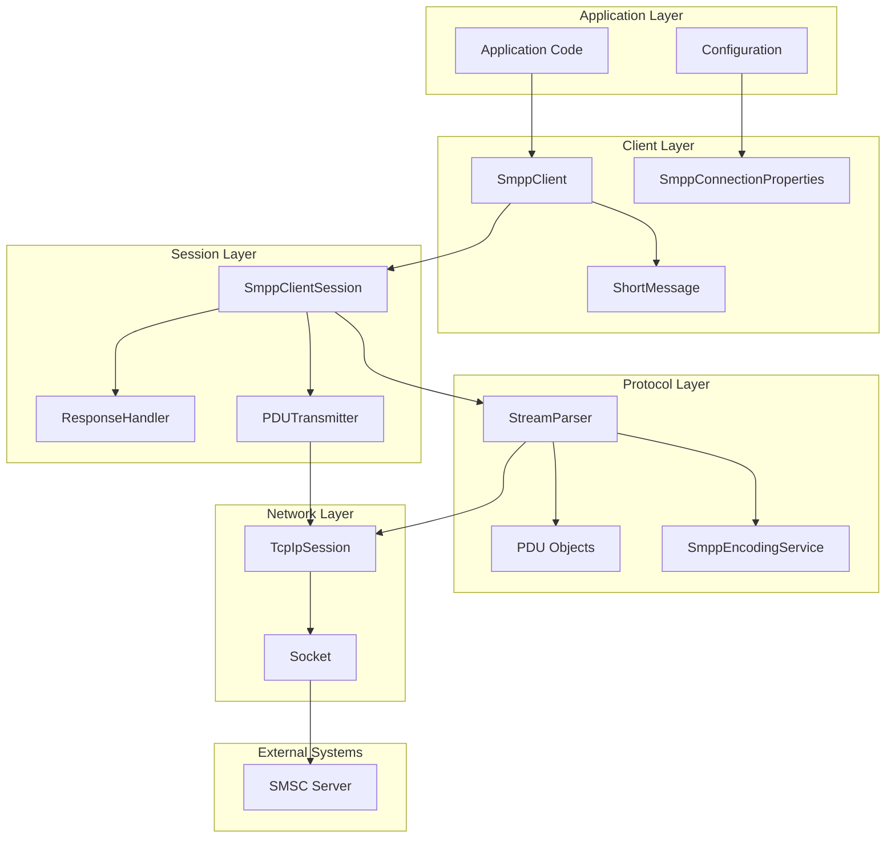

### Component Layers
1. **Application Layer**: User code and configuration
2. **Client Layer**: High-level SMPP client interface
3. **Session Layer**: Session management and coordination
4. **Protocol Layer**: SMPP protocol implementation
5. **Network Layer**: TCP/IP communication
6. **External Systems**: SMSC servers and network infrastructure

## Component Relationships

### Core Component Dependencies
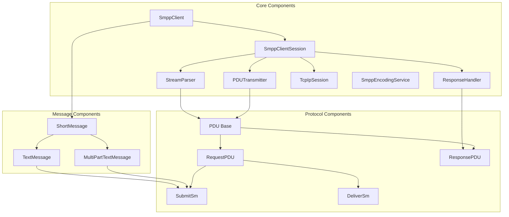

### Component Responsibilities Matrix
| Component | Primary Responsibility | Dependencies | Events |
|-----------|----------------------|--------------|--------|
| SmppClient | High-level interface, connection management | SmppClientSession, ShortMessage | ConnectionStateChanged, MessageReceived, MessageSent |
| SmppClientSession | Session coordination, PDU processing | StreamParser, PDUTransmitter, ResponseHandler | PduReceived, SessionClosed |
| StreamParser | Byte stream parsing, PDU creation | TcpIpSession, SmppEncodingService | PDUError, ParserException |
| PDUTransmitter | PDU transmission | TcpIpSession | None |
| ResponseHandler | Response queuing, timeout management | None | None |
| TcpIpSession | TCP/IP communication | Socket | SessionClosed, SessionException |
| SmppEncodingService | Character encoding/decoding | None | None |

## Data Flow

### Outgoing Message Flow
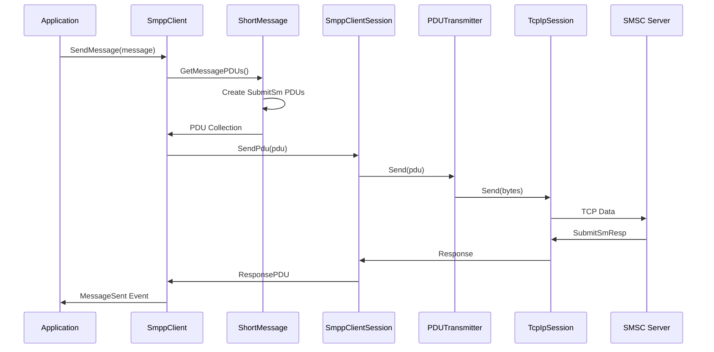

### Incoming Message Flow
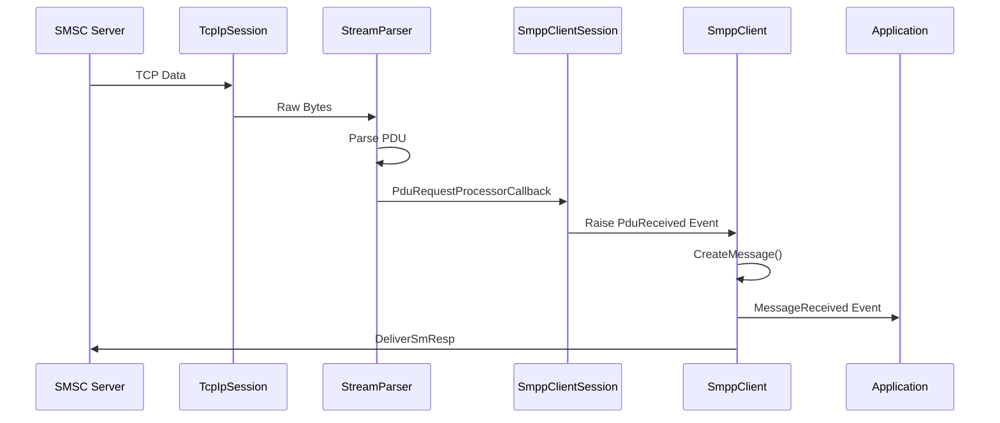

### Connection Establishment Flow
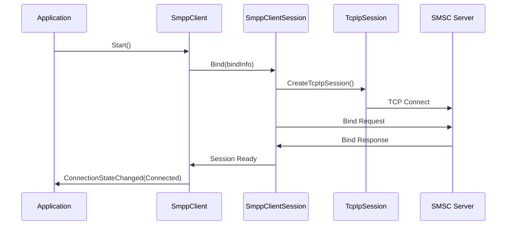

## Protocol Stack

### SMPP Protocol Layers
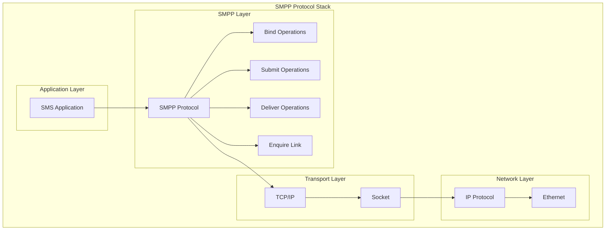

### PDU Structure
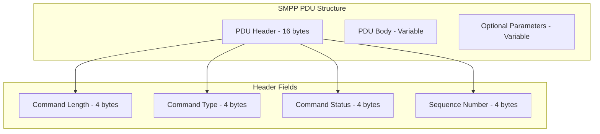

## Threading Model

### Thread Architecture
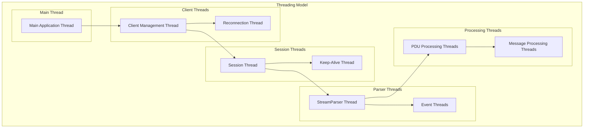

### Thread Safety
- **SmppClient**: Thread-safe for multiple operations
- **SmppClientSession**: Thread-safe with proper synchronization
- **StreamParser**: Runs in dedicated background thread
- **PDUTransmitter**: Thread-safe (stateless)
- **ResponseHandler**: Thread-safe with locking mechanisms
- **TcpIpSession**: Thread-safe with connection state management

## Error Handling Strategy

### Error Hierarchy
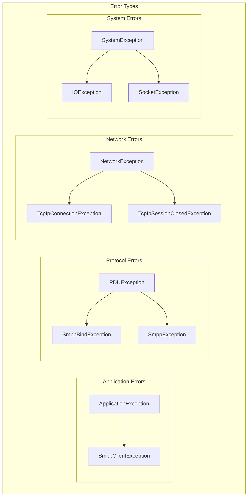

### Error Recovery Mechanisms
1. **Connection Errors**: Automatic reconnection with configurable delays
2. **Protocol Errors**: Error response generation and session continuation
3. **Message Errors**: Individual message failure handling without affecting connection
4. **Parser Errors**: Malformed PDU handling with error reporting

## Configuration Management

### Configuration Hierarchy
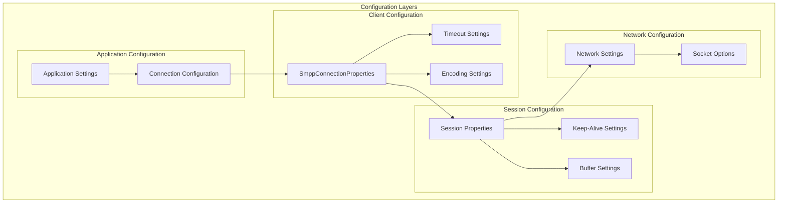

### Configuration Properties
| Level | Property | Description | Default |
|-------|----------|-------------|---------|
| Client | AutoReconnectDelay | Reconnection delay | 10000ms |
| Client | KeepAliveInterval | EnquireLink interval | 30000ms |
| Client | ConnectionTimeout | Connection timeout | 5000ms |
| Session | DefaultResponseTimeout | PDU response timeout | 5000ms |
| Session | EnquireLinkInterval | Keep-alive interval | 60000ms |
| Network | SendBufferSize | TCP send buffer | 1024 bytes |
| Network | ReceiveBufferSize | TCP receive buffer | 4096 bytes |

## Performance Characteristics

### Performance Metrics
| Operation | Typical Latency | Throughput | Memory Usage |
|-----------|----------------|------------|--------------|
| Single Message Send | 50-200ms | 100-500 msg/sec | Low |
| Multi-Part Message | 100-500ms | 50-200 msg/sec | Medium |
| Connection Establishment | 1-5 seconds | N/A | Low |
| PDU Parsing | <1ms | 1000+ PDU/sec | Low |
| Message Encoding | <1ms | 1000+ msg/sec | Low |

### Scalability Considerations
1. **Connection Pooling**: Multiple client instances for high throughput
2. **Message Queuing**: Implement queuing for burst handling
3. **Resource Management**: Monitor memory and connection usage
4. **Load Balancing**: Distribute load across multiple SMSC connections

## Deployment Considerations

### Production Deployment
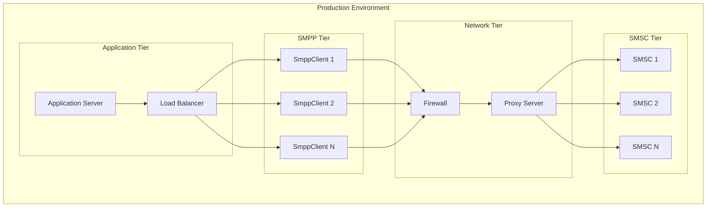

### Deployment Best Practices
1. **High Availability**: Multiple client instances with failover
2. **Monitoring**: Comprehensive logging and metrics collection
3. **Security**: Secure credential management and network security
4. **Scalability**: Horizontal scaling with load balancing
5. **Backup**: Multiple SMSC providers for redundancy

### Monitoring and Alerting
- **Connection Health**: Monitor connection state and reconnection events
- **Message Throughput**: Track message send/receive rates
- **Error Rates**: Monitor error frequencies and types
- **Resource Usage**: Monitor memory, CPU, and network usage
- **Delivery Rates**: Track message delivery success rates

The Jamaa SMPP Library provides a robust, scalable, and maintainable foundation for SMS communication in .NET applications, with comprehensive support for all aspects of SMPP protocol implementation and production deployment scenarios.
