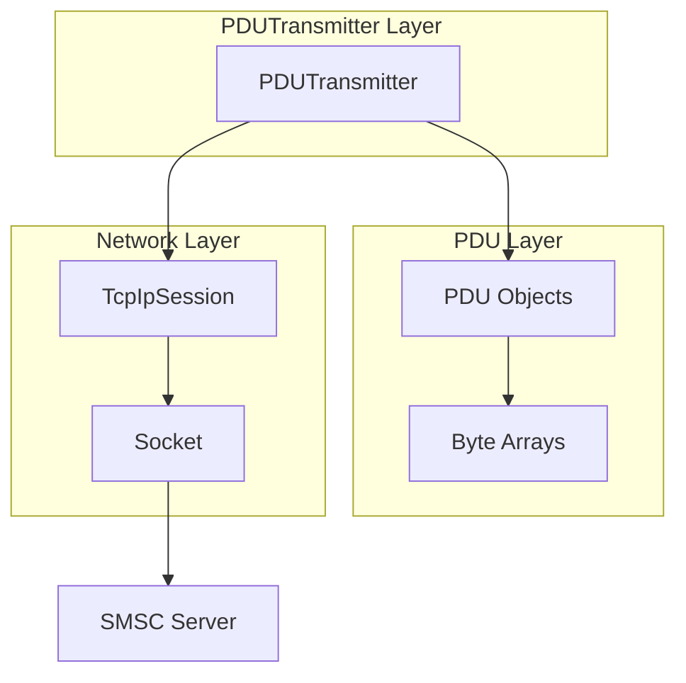
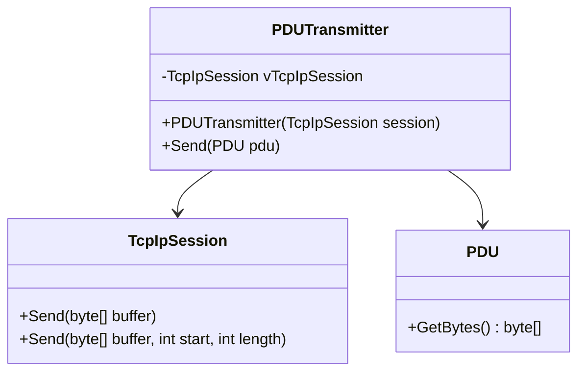
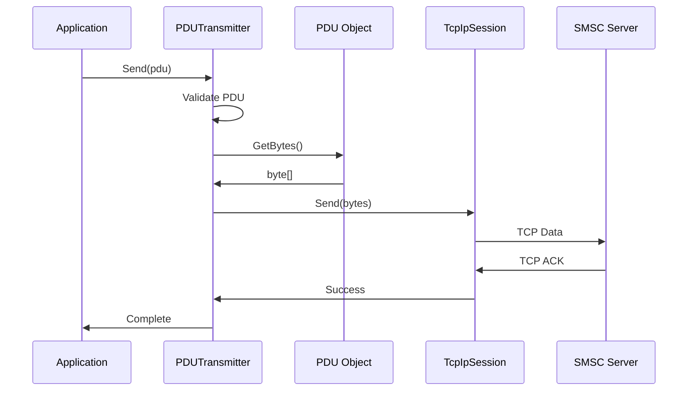
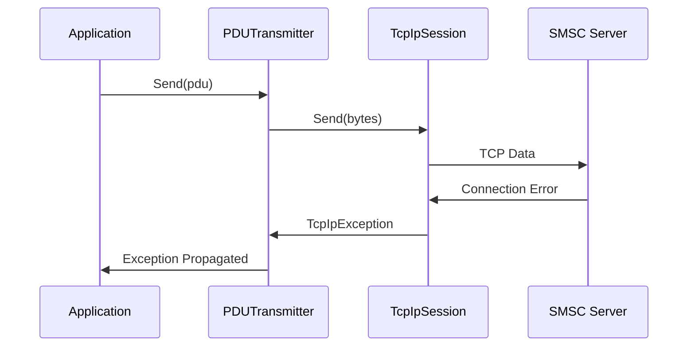
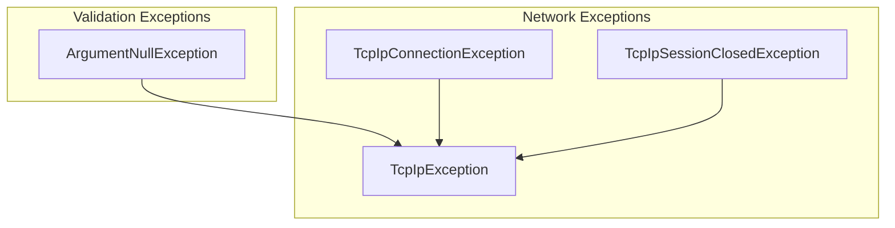

# PDUTransmitter Documentation

## Table of Contents
1. [Overview](#overview)
2. [Architecture](#architecture)
3. [Class Structure](#class-structure)
4. [Methods](#methods)
5. [Data Flow](#data-flow)
6. [Error Handling](#error-handling)
7. [Usage Examples](#usage-examples)
8. [Performance Considerations](#performance-considerations)

## Overview

The `PDUTransmitter` is a lightweight component responsible for transmitting Protocol Data Units (PDUs) over TCP/IP connections to SMPP servers. It serves as a simple wrapper around the underlying `TcpIpSession`, providing a clean interface for PDU transmission while handling the conversion from PDU objects to byte arrays.

### Key Responsibilities
- **PDU Serialization**: Converts PDU objects to byte arrays
- **TCP Transmission**: Sends serialized data over TCP/IP connections
- **Error Propagation**: Passes through network errors from the underlying session
- **Null Validation**: Ensures PDU objects are valid before transmission

## Architecture

The PDUTransmitter operates as a thin layer between PDU objects and the TCP/IP session:



## Class Structure

### Class Definition


### Dependencies
- **TcpIpSession**: Provides TCP/IP communication capabilities
- **PDU**: Protocol Data Unit objects to be transmitted

## Methods

### Constructor
```csharp
public PDUTransmitter(TcpIpSession session)
```
**Purpose**: Initializes a new PDUTransmitter instance
**Parameters**:
- `session`: The TCP/IP session to use for transmission
**Validation**: Throws `ArgumentNullException` if session is null
**Behavior**: Stores reference to the TCP/IP session

### Send Method
```csharp
public void Send(PDU pdu)
```
**Purpose**: Sends a PDU to the SMSC server
**Parameters**:
- `pdu`: The PDU object to send
**Validation**: Throws `ArgumentNullException` if PDU is null
**Returns**: `void`
**Behavior**:
1. Validates PDU parameter
2. Serializes PDU to byte array using `pdu.GetBytes()`
3. Sends byte array via TCP/IP session
4. Propagates any network errors

## Data Flow

### PDU Transmission Flow


### PDU Serialization Process
```mermaid
flowchart TD
    A[PDU Object] --> B[GetBytes() Method]
    B --> C[Create ByteBuffer]
    C --> D[Append Header Bytes]
    D --> E[Append Body Bytes]
    E --> F[Append TLV Bytes]
    F --> G[Return Byte Array]
    G --> H[Send via TCP]
```

### Error Flow


## Error Handling

### Exception Types


### Error Handling Strategy
1. **Input Validation**: Validates PDU parameter before processing
2. **Error Propagation**: Passes through all network errors from TcpIpSession
3. **No Error Recovery**: Does not attempt to recover from errors (handled by higher layers)

### Error Scenarios
| Scenario | Exception | Handling |
|----------|-----------|----------|
| Null PDU | `ArgumentNullException` | Immediate throw |
| Null Session | `ArgumentNullException` | Constructor validation |
| Network Error | `TcpIpException` | Propagated to caller |
| Connection Lost | `TcpIpSessionClosedException` | Propagated to caller |

## Usage Examples

### Basic Usage
```csharp
// Create TCP/IP session
TcpIpSession session = TcpIpSession.OpenClientSession("smpp.provider.com", 2775);

// Create PDUTransmitter
PDUTransmitter transmitter = new PDUTransmitter(session);

// Create and send a PDU
SubmitSm submitSm = new SubmitSm(encodingService);
submitSm.ServiceType = "SMS";
submitSm.SourceAddress = new SmppAddress("12345");
submitSm.DestinationAddress = new SmppAddress("1234567890");
submitSm.ShortMessage = "Hello, World!";

try
{
    transmitter.Send(submitSm);
    Console.WriteLine("PDU sent successfully");
}
catch (TcpIpException ex)
{
    Console.WriteLine($"Network error: {ex.Message}");
}
```

### Error Handling
```csharp
try
{
    // Send PDU
    transmitter.Send(pdu);
}
catch (ArgumentNullException)
{
    Console.WriteLine("PDU cannot be null");
}
catch (TcpIpSessionClosedException ex)
{
    Console.WriteLine($"Connection lost: {ex.Message}");
    // Handle connection loss
}
catch (TcpIpException ex)
{
    Console.WriteLine($"Network error: {ex.Message}");
    // Handle other network errors
}
```

### Integration with SmppClientSession
```csharp
public class SmppClientSession
{
    private PDUTransmitter vTrans;
    
    private void AssembleComponents()
    {
        // Create PDUTransmitter with TCP session
        vTrans = new PDUTransmitter(vTcpIpSession);
    }
    
    private void SendPduBase(PDU pdu)
    {
        try 
        { 
            vTrans.Send(pdu); 
        }
        catch (Exception ex)
        {
            // Log error and handle
            _Log.ErrorFormat("PDU send operation failed - {0}", ex, ex.Message);
            throw;
        }
    }
}
```

### Batch PDU Transmission
```csharp
// Send multiple PDUs
List<PDU> pdus = new List<PDU>();
// ... populate PDUs ...

foreach (PDU pdu in pdus)
{
    try
    {
        transmitter.Send(pdu);
    }
    catch (TcpIpException ex)
    {
        Console.WriteLine($"Failed to send PDU: {ex.Message}");
        // Decide whether to continue or stop
        break;
    }
}
```

## Performance Considerations

### Memory Management
- **Byte Array Creation**: Each PDU serialization creates a new byte array
- **No Buffering**: No internal buffering - each send is immediate
- **Garbage Collection**: Frequent PDU sending may create GC pressure

### Network Optimization
- **TCP Buffering**: Relies on TCP socket buffering for efficiency
- **No Compression**: No compression of PDU data
- **Immediate Send**: No batching or queuing of PDUs

### Thread Safety
- **Not Thread-Safe**: PDUTransmitter is not thread-safe
- **Session Dependency**: Thread safety depends on underlying TcpIpSession
- **Concurrent Access**: Multiple threads should not access the same instance

### Best Practices
1. **Reuse Instances**: Reuse PDUTransmitter instances when possible
2. **Error Handling**: Always wrap Send calls in try-catch blocks
3. **Connection Monitoring**: Monitor underlying TCP session health
4. **Resource Management**: Ensure proper disposal of TCP sessions

### Performance Monitoring
```csharp
// Monitor transmission performance
Stopwatch stopwatch = Stopwatch.StartNew();
transmitter.Send(pdu);
stopwatch.Stop();
Console.WriteLine($"PDU transmission took: {stopwatch.ElapsedMilliseconds}ms");
```

### Memory Usage Considerations
```csharp
// For high-volume scenarios, consider:
// 1. Object pooling for PDUs
// 2. Byte array pooling
// 3. Monitoring GC pressure

// Example with memory monitoring
long memoryBefore = GC.GetTotalMemory(false);
transmitter.Send(pdu);
long memoryAfter = GC.GetTotalMemory(false);
Console.WriteLine($"Memory allocated: {memoryAfter - memoryBefore} bytes");
```

## Integration Patterns

### Factory Pattern
```csharp
public static class PDUTransmitterFactory
{
    public static PDUTransmitter Create(TcpIpSession session)
    {
        if (session == null)
            throw new ArgumentNullException(nameof(session));
            
        return new PDUTransmitter(session);
    }
}
```

### Decorator Pattern
```csharp
public class LoggingPDUTransmitter : PDUTransmitter
{
    private readonly ILog _logger;
    
    public LoggingPDUTransmitter(TcpIpSession session, ILog logger) 
        : base(session)
    {
        _logger = logger;
    }
    
    public new void Send(PDU pdu)
    {
        _logger.Debug($"Sending PDU: {pdu.Header.CommandType}");
        base.Send(pdu);
        _logger.Debug($"PDU sent successfully");
    }
}
```

### Retry Pattern
```csharp
public class RetryPDUTransmitter : PDUTransmitter
{
    private readonly int _maxRetries;
    
    public RetryPDUTransmitter(TcpIpSession session, int maxRetries = 3) 
        : base(session)
    {
        _maxRetries = maxRetries;
    }
    
    public new void Send(PDU pdu)
    {
        int attempts = 0;
        while (attempts < _maxRetries)
        {
            try
            {
                base.Send(pdu);
                return; // Success
            }
            catch (TcpIpException ex) when (attempts < _maxRetries - 1)
            {
                attempts++;
                Thread.Sleep(1000 * attempts); // Exponential backoff
            }
        }
        
        // Final attempt failed
        base.Send(pdu);
    }
}
```

The PDUTransmitter is a simple but essential component that provides a clean interface for PDU transmission while maintaining separation of concerns between protocol handling and network communication. Its lightweight design makes it efficient for high-volume scenarios while its simple interface makes it easy to test and maintain.
