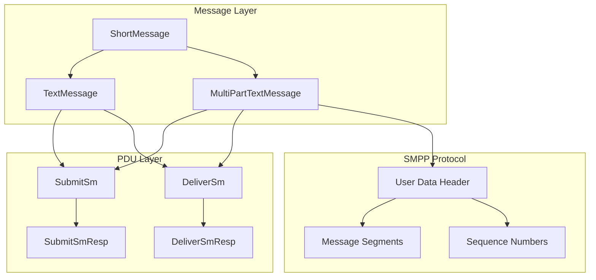
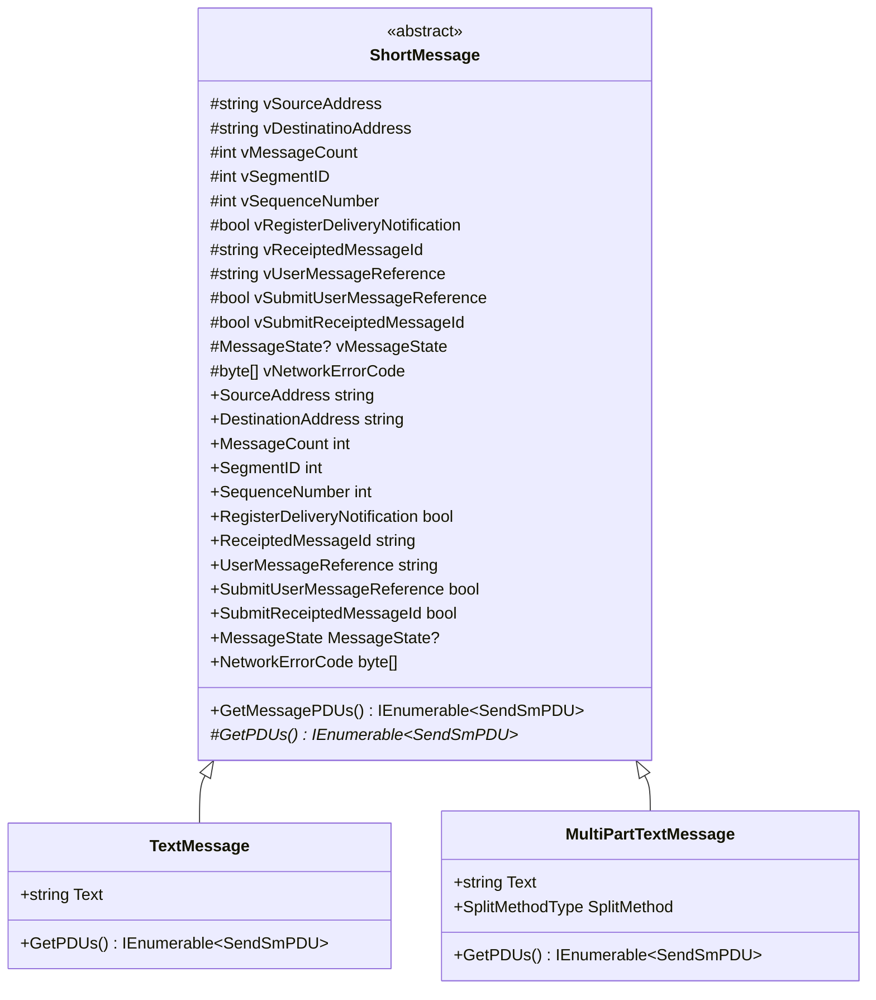
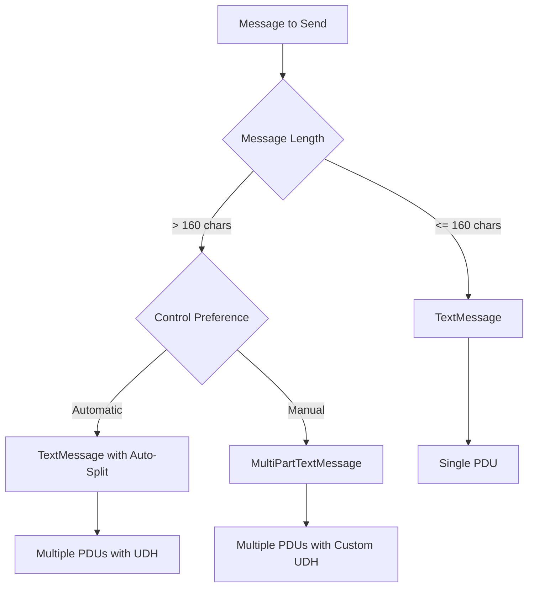
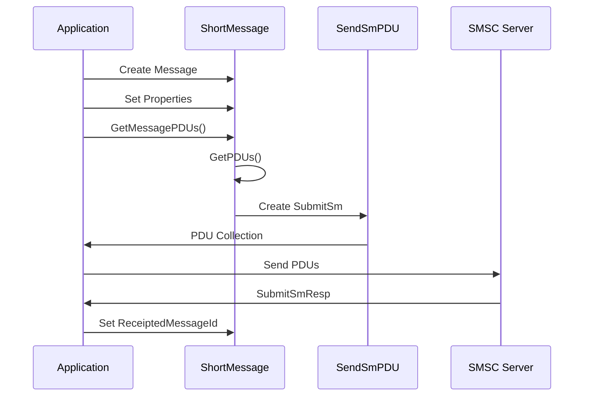
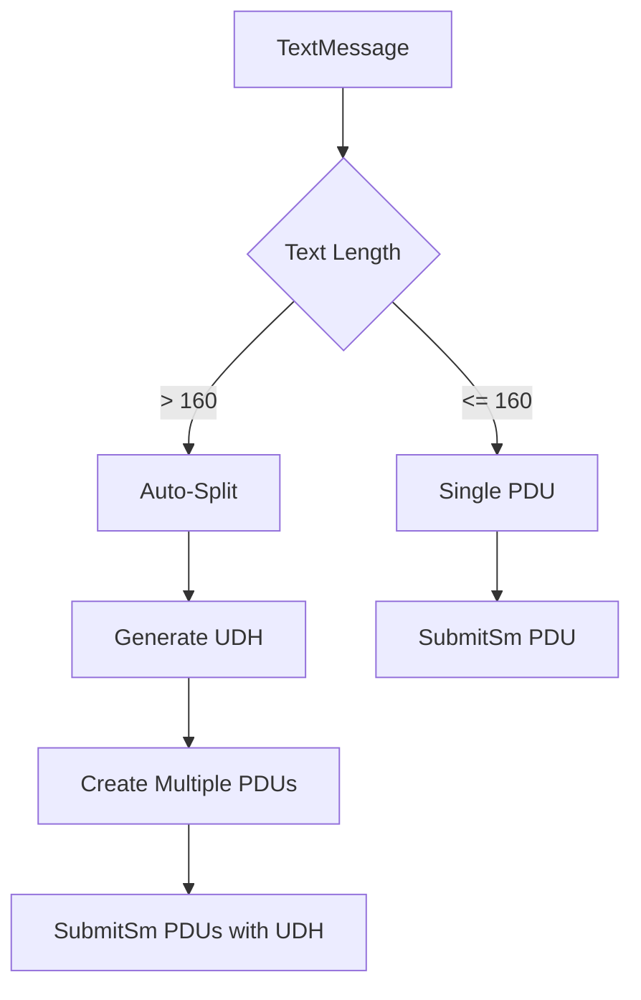
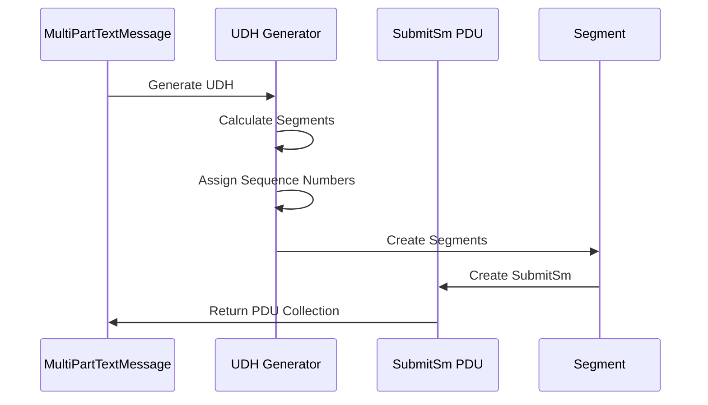
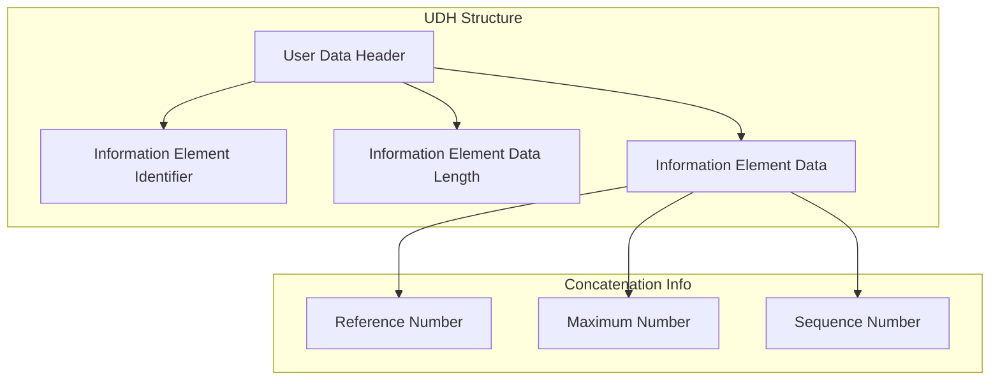

# ShortMessage Documentation

## Table of Contents
1. [Overview](#overview)
2. [Architecture](#architecture)
3. [Class Structure](#class-structure)
4. [Message Types](#message-types)
5. [Properties](#properties)
6. [Methods](#methods)
7. [Message Processing](#message-processing)
8. [Multi-Part Messages](#multi-part-messages)
9. [Usage Examples](#usage-examples)
10. [Best Practices](#best-practices)

## Overview

The `ShortMessage` class hierarchy provides a comprehensive framework for handling SMS messages in the SMPP library. It includes support for simple text messages, multi-part concatenated messages, and delivery receipts, with automatic PDU generation and message splitting capabilities.

### Key Responsibilities
- **Message Representation**: Provides structured representation of SMS messages
- **PDU Generation**: Converts messages to SMPP PDUs for transmission
- **Multi-Part Support**: Handles concatenated messages with UDH (User Data Header)
- **Delivery Tracking**: Manages delivery receipts and message states
- **Address Management**: Handles source and destination addresses
- **Message Splitting**: Automatically splits long messages into multiple parts

## Architecture

The ShortMessage hierarchy operates as a bridge between high-level message objects and low-level SMPP PDUs:



## Class Structure

### Class Hierarchy


### Core Dependencies
- **SendSmPDU**: SMPP SubmitSm PDU for message transmission
- **SmppAddress**: Address representation for source and destination
- **DataCoding**: Character encoding specification
- **SmppEncodingService**: Encoding/decoding service
- **Udh**: User Data Header for concatenated messages

## Message Types

### TextMessage
**Purpose**: Simple text messages (single or automatically split)
**Characteristics**:
- Single text property
- Automatic message splitting
- Standard SMPP encoding support
- Delivery notification support

### MultiPartTextMessage
**Purpose**: Explicitly controlled multi-part messages
**Characteristics**:
- Manual control over splitting
- Custom UDH generation
- Segment management
- Sequence number control

### Message Type Selection


## Properties

### Address Properties
| Property | Type | Description |
|----------|------|-------------|
| `SourceAddress` | `string` | Sender's phone number or short code |
| `DestinationAddress` | `string` | Recipient's phone number |

### Message Properties
| Property | Type | Description |
|----------|------|-------------|
| `MessageCount` | `int` | Total number of segments in concatenated message |
| `SegmentID` | `int` | Index of this segment (0-based) |
| `SequenceNumber` | `int` | Sequence number for concatenated message |

### Delivery Properties
| Property | Type | Description |
|----------|------|-------------|
| `RegisterDeliveryNotification` | `bool` | Request delivery receipt |
| `ReceiptedMessageId` | `string` | SMSC-assigned message ID |
| `UserMessageReference` | `string` | User-defined message reference |
| `SubmitUserMessageReference` | `bool` | Include user reference in submission |
| `SubmitReceiptedMessageId` | `bool` | Include receipted ID in submission |

### Status Properties
| Property | Type | Description |
|----------|------|-------------|
| `MessageState` | `MessageState?` | Final delivery state |
| `NetworkErrorCode` | `byte[]` | Network error code for failed deliveries |

## Methods

### PDU Generation
```csharp
internal IEnumerable<SendSmPDU> GetMessagePDUs(DataCoding defaultEncoding, SmppEncodingService smppEncodingService, SmppAddress destAddress, SmppAddress srcAddress)
protected abstract IEnumerable<SendSmPDU> GetPDUs(DataCoding defaultEncoding, SmppEncodingService smppEncodingService, SmppAddress destAddress = null, SmppAddress srcAddress = null)
```
**Purpose**: Converts message to SMPP PDUs for transmission
**Parameters**:
- `defaultEncoding`: Default character encoding
- `smppEncodingService`: Encoding service instance
- `destAddress`: Destination address
- `srcAddress`: Source address
**Returns**: Collection of SubmitSm PDUs

### Message Processing Flow


## Message Processing

### Single Message Processing


### Multi-Part Message Processing


### UDH (User Data Header) Structure


## Multi-Part Messages

### Automatic Splitting
```csharp
// TextMessage automatically splits long messages
TextMessage longMessage = new TextMessage();
longMessage.Text = "This is a very long message that will be automatically split into multiple parts when sent to the SMSC...";
longMessage.DestinationAddress = "1234567890";

// GetMessagePDUs will return multiple PDUs with UDH
var pdus = longMessage.GetMessagePDUs(DataCoding.ASCII, encodingService, destAddress, srcAddress);
// Returns multiple SubmitSm PDUs with concatenation information
```

### Manual Multi-Part Control
```csharp
// MultiPartTextMessage for explicit control
MultiPartTextMessage multiPart = new MultiPartTextMessage();
multiPart.Text = "Long message text...";
multiPart.DestinationAddress = "1234567890";
multiPart.SplitMethod = SplitMethodType.UDH; // Use UDH for concatenation

// GetMessagePDUs returns controlled segments
var pdus = multiPart.GetMessagePDUs(DataCoding.ASCII, encodingService, destAddress, srcAddress);
```

### UDH Generation
```csharp
// UDH contains concatenation information
// IEI: 0x00 (Concatenated short messages)
// IEDL: 0x03 (3 bytes of data)
// IED: [ReferenceNumber, MaxSegments, SequenceNumber]

// Example UDH for 3-part message, segment 2:
// [0x05, 0x00, 0x03, 0x12, 0x34, 0x02]
// 0x05: UDH length
// 0x00: IEI (concatenation)
// 0x03: IEDL (3 bytes)
// 0x12, 0x34: Reference number
// 0x02: Sequence number (2 of 3)
```

## Usage Examples

### Basic Text Message
```csharp
// Create simple text message
TextMessage message = new TextMessage();
message.SourceAddress = "12345";
message.DestinationAddress = "1234567890";
message.Text = "Hello, World!";
message.RegisterDeliveryNotification = true;

// Send via SmppClient
client.SendMessage(message);
```

### Long Message (Auto-Split)
```csharp
// Create long message - automatically split
TextMessage longMessage = new TextMessage();
longMessage.DestinationAddress = "1234567890";
longMessage.Text = "This is a very long message that contains more than 160 characters and will be automatically split into multiple parts when sent to the SMSC server for delivery to the recipient.";
longMessage.RegisterDeliveryNotification = true;

// SmppClient handles splitting automatically
client.SendMessage(longMessage);
```

### Multi-Part Message with Control
```csharp
// Create multi-part message with explicit control
MultiPartTextMessage multiPart = new MultiPartTextMessage();
multiPart.DestinationAddress = "1234567890";
multiPart.Text = "This is a long message that will be split into multiple parts with explicit control over the splitting process and UDH generation.";
multiPart.SplitMethod = SplitMethodType.UDH;
multiPart.RegisterDeliveryNotification = true;

// Send with controlled splitting
client.SendMessage(multiPart);
```

### Message with Custom Properties
```csharp
// Create message with custom properties
TextMessage customMessage = new TextMessage();
customMessage.SourceAddress = "MyApp";
customMessage.DestinationAddress = "1234567890";
customMessage.Text = "Custom message";
customMessage.RegisterDeliveryNotification = true;
customMessage.UserMessageReference = "MSG-001";
customMessage.SubmitUserMessageReference = true;

// Send with custom reference
client.SendMessage(customMessage);
```

### Handling Delivery Receipts
```csharp
// Subscribe to delivery events
client.MessageDelivered += (sender, e) => {
    ShortMessage receipt = e.Message;
    Console.WriteLine($"Message delivered: {receipt.ReceiptedMessageId}");
    Console.WriteLine($"Message state: {receipt.MessageState}");
    Console.WriteLine($"User reference: {receipt.UserMessageReference}");
    
    if (receipt.NetworkErrorCode != null)
    {
        Console.WriteLine($"Network error: {BitConverter.ToString(receipt.NetworkErrorCode)}");
    }
};

// Send message with delivery notification
TextMessage message = new TextMessage();
message.DestinationAddress = "1234567890";
message.Text = "Message with delivery receipt";
message.RegisterDeliveryNotification = true;
message.UserMessageReference = "MSG-002";

client.SendMessage(message);
```

### Advanced PDU Generation
```csharp
// Generate PDUs manually for advanced scenarios
TextMessage message = new TextMessage();
message.DestinationAddress = "1234567890";
message.Text = "Advanced message";

// Create addresses
SmppAddress destAddress = new SmppAddress("1234567890");
SmppAddress srcAddress = new SmppAddress("12345");

// Generate PDUs
var pdus = message.GetMessagePDUs(DataCoding.ASCII, encodingService, destAddress, srcAddress);

// Send each PDU individually
foreach (var pdu in pdus)
{
    ResponsePDU response = client.SendPdu(pdu, 5000);
    if (response is SubmitSmResp submitResp)
    {
        Console.WriteLine($"Message ID: {submitResp.MessageID}");
    }
}
```

### Message State Tracking
```csharp
// Track message states
Dictionary<string, ShortMessage> sentMessages = new Dictionary<string, ShortMessage>();

// Send message and track
TextMessage message = new TextMessage();
message.UserMessageReference = Guid.NewGuid().ToString();
message.DestinationAddress = "1234567890";
message.Text = "Tracked message";
message.RegisterDeliveryNotification = true;

sentMessages[message.UserMessageReference] = message;
client.SendMessage(message);

// Handle delivery receipt
client.MessageDelivered += (sender, e) => {
    string userRef = e.Message.UserMessageReference;
    if (sentMessages.TryGetValue(userRef, out ShortMessage originalMessage))
    {
        Console.WriteLine($"Original message: {originalMessage.Text}");
        Console.WriteLine($"Delivery state: {e.Message.MessageState}");
        Console.WriteLine($"SMSC message ID: {e.Message.ReceiptedMessageId}");
    }
};
```

## Best Practices

### Message Creation
1. **Use appropriate message types**: TextMessage for simple cases, MultiPartTextMessage for control
2. **Set delivery notifications**: Enable for important messages
3. **Use meaningful references**: Set UserMessageReference for tracking
4. **Validate addresses**: Ensure phone numbers are properly formatted

### Performance Optimization
1. **Reuse message objects**: When possible, reuse instances
2. **Batch operations**: Group multiple messages when sending
3. **Monitor memory**: Watch for memory usage with large message volumes
4. **Use appropriate encoding**: Choose encoding based on content

### Error Handling
1. **Handle delivery failures**: Monitor MessageState for failures
2. **Implement retry logic**: For transient failures
3. **Log message details**: Include UserMessageReference in logs
4. **Monitor network errors**: Check NetworkErrorCode for failures

### Security Considerations
1. **Validate input**: Sanitize message content
2. **Rate limiting**: Implement appropriate sending rates
3. **Content filtering**: Filter inappropriate content
4. **Address validation**: Validate phone number formats

### Production Deployment
1. **Message queuing**: Implement queuing for high volumes
2. **Monitoring**: Track message success/failure rates
3. **Alerting**: Set up alerts for delivery failures
4. **Backup strategies**: Handle SMSC unavailability

The ShortMessage hierarchy provides a comprehensive and flexible framework for SMS message handling, supporting everything from simple text messages to complex multi-part concatenated messages with full delivery tracking capabilities.
