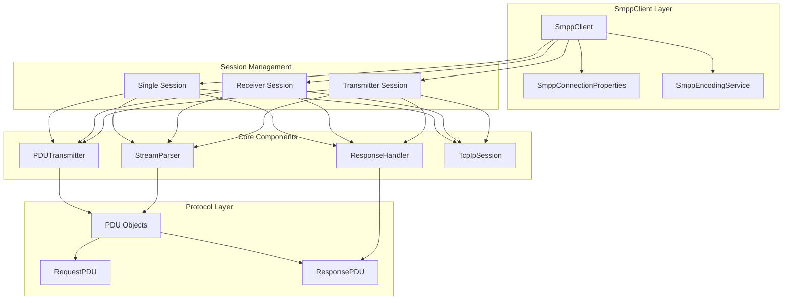
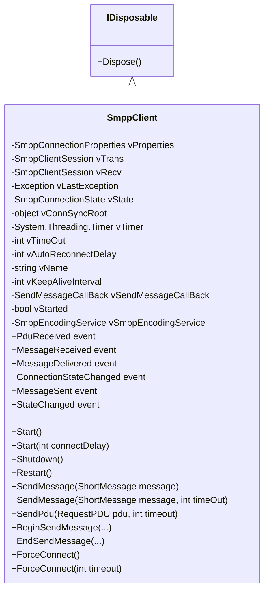
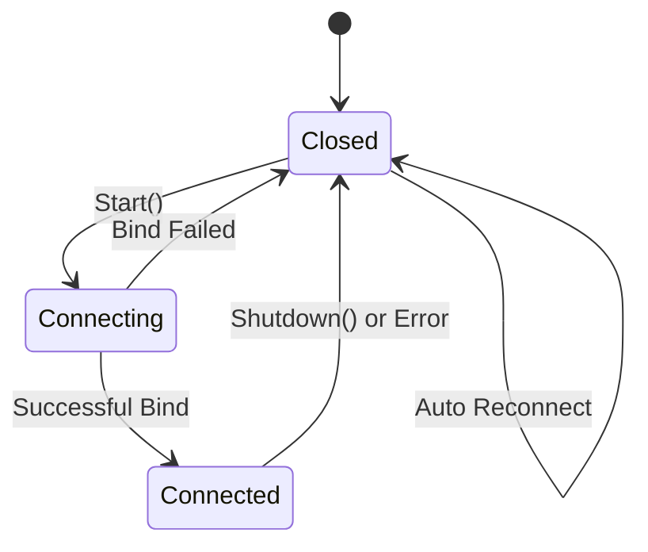
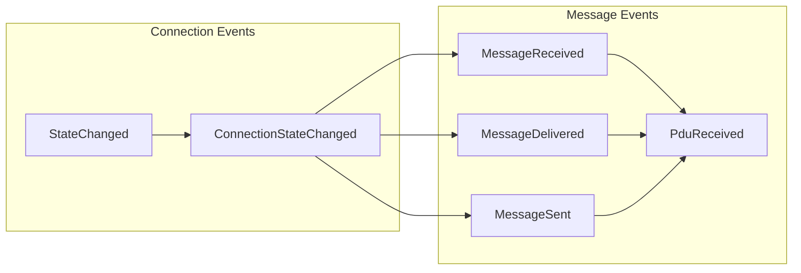
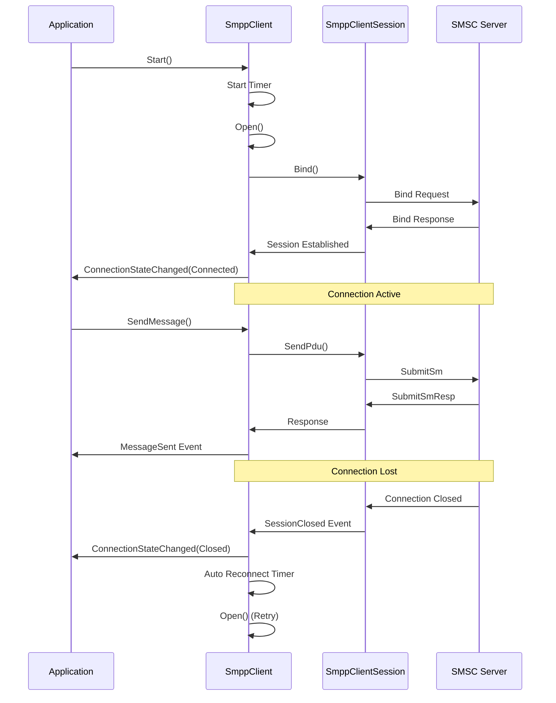
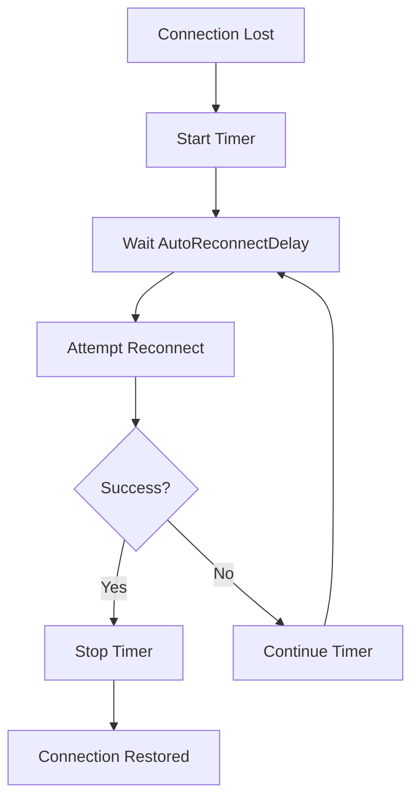
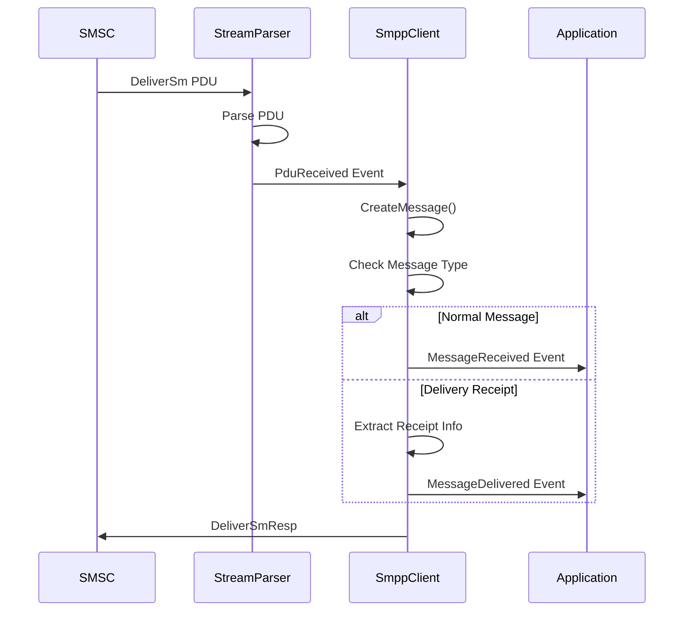
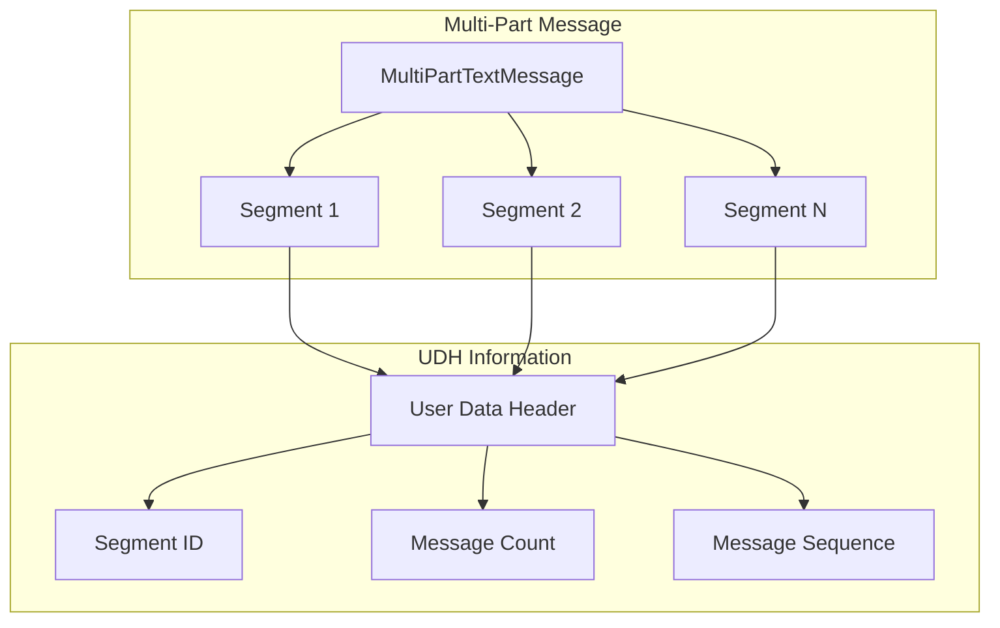
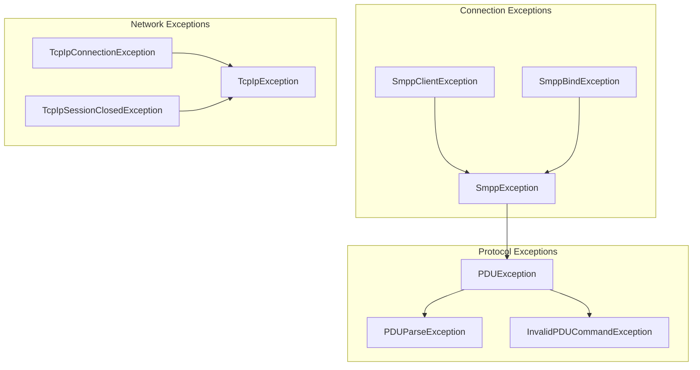
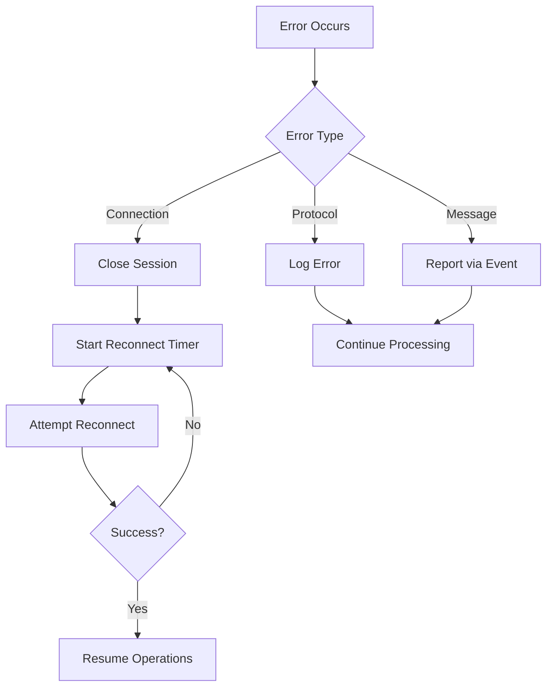

# SmppClient Documentation

## Table of Contents
1. [Overview](#overview)
2. [Architecture](#architecture)
3. [Class Structure](#class-structure)
4. [Properties](#properties)
5. [Events](#events)
6. [Methods](#methods)
7. [Connection Management](#connection-management)
8. [Message Handling](#message-handling)
9. [Error Handling](#error-handling)
10. [Usage Examples](#usage-examples)
11. [Best Practices](#best-practices)

## Overview

The `SmppClient` is the main entry point for the Jamaa SMPP Library, providing a high-level interface for SMPP (Short Message Peer-to-Peer) communication. It encapsulates the complexity of SMPP protocol handling, session management, and message processing, offering a simple and robust API for SMS applications.

### Key Responsibilities
- **Connection Management**: Establishes and maintains SMPP connections with SMSC servers
- **Session Coordination**: Manages transmitter and receiver sessions (separate or combined)
- **Message Processing**: Handles sending and receiving SMS messages
- **Automatic Reconnection**: Provides automatic reconnection capabilities
- **Event Handling**: Raises events for connection state changes and message events
- **Protocol Abstraction**: Hides SMPP protocol complexity from application developers

## Architecture

The SmppClient operates as a high-level coordinator that manages multiple lower-level components:



## Class Structure

### Class Hierarchy


### Core Dependencies
- **SmppConnectionProperties**: Configuration and connection settings
- **SmppClientSession**: Low-level session management (transmitter/receiver)
- **SmppEncodingService**: Character encoding and decoding services
- **ShortMessage**: Message objects for SMS content
- **PDU Objects**: Protocol Data Units for SMPP communication

## Properties

### Connection Properties
| Property | Type | Description |
|----------|------|-------------|
| `ConnectionState` | `SmppConnectionState` | Current connection state (Closed, Connecting, Connected) |
| `Started` | `bool` | Indicates if the client is started |
| `Properties` | `SmppConnectionProperties` | Connection configuration properties |
| `LastException` | `Exception` | Last exception that occurred during connection |

### Configuration Properties
| Property | Type | Description |
|----------|------|-------------|
| `AutoReconnectDelay` | `int` | Delay in milliseconds before attempting reconnection |
| `KeepAliveInterval` | `int` | Interval for sending EnquireLink PDUs |
| `ConnectionTimeout` | `int` | Timeout for synchronous operations |
| `Name` | `string` | Name identifier for this client instance |
| `SmppEncodingService` | `SmppEncodingService` | Encoding service for character handling |

### Connection States


## Events

### Event Types


### Event Details

#### ConnectionStateChanged
```csharp
public event EventHandler<ConnectionStateChangedEventArgs> ConnectionStateChanged;
```
**Purpose**: Raised when the connection state changes
**Event Args**: `ConnectionStateChangedEventArgs`
- `NewState`: Current connection state
- `OldState`: Previous connection state
- `ReconnectInteval`: Configurable reconnect interval

#### MessageReceived
```csharp
public event EventHandler<MessageEventArgs> MessageReceived;
```
**Purpose**: Raised when an SMS message is received from the SMSC
**Event Args**: `MessageEventArgs`
- `Message`: The received `ShortMessage` object

#### MessageDelivered
```csharp
public event EventHandler<MessageEventArgs> MessageDelivered;
```
**Purpose**: Raised when a delivery receipt is received
**Event Args**: `MessageEventArgs`
- `Message`: The delivery receipt message with status information

#### MessageSent
```csharp
public event EventHandler<MessageEventArgs> MessageSent;
```
**Purpose**: Raised when a message is successfully sent
**Event Args**: `MessageEventArgs`
- `Message`: The sent message with SMSC-assigned message ID

#### PduReceived
```csharp
public event EventHandler<PduReceivedEventArgs> PduReceived;
```
**Purpose**: Raised when any PDU is received (for advanced users)
**Event Args**: `PduReceivedEventArgs`
- `Request`: The received request PDU
- `Response`: Optional response PDU to send back

#### StateChanged
```csharp
public event EventHandler<StateChangedEventArgs> StateChanged;
```
**Purpose**: Raised when the client is started or shut down
**Event Args**: `StateChangedEventArgs`
- `Started`: Boolean indicating if client is started

## Methods

### Connection Management

#### Start Methods
```csharp
public virtual void Start()
public virtual void Start(int connectDelay)
```
**Purpose**: Starts the client and begins connection attempts
**Parameters**:
- `connectDelay`: Optional delay before first connection attempt
**Behavior**: 
- Sets `Started` to true
- Starts auto-reconnect timer
- Raises `StateChanged` event

#### Shutdown
```csharp
public virtual void Shutdown()
```
**Purpose**: Gracefully shuts down the client
**Behavior**:
- Sets `Started` to false
- Stops auto-reconnect timer
- Closes all sessions
- Raises `StateChanged` event

#### Restart
```csharp
public virtual void Restart()
```
**Purpose**: Restarts the client (shutdown then start)
**Behavior**: Calls `Shutdown()` followed by `Start()`

#### Force Connect
```csharp
public virtual void ForceConnect()
public virtual void ForceConnect(int timeout)
```
**Purpose**: Immediately attempts to connect without waiting for auto-reconnect
**Parameters**:
- `timeout`: Connection timeout in milliseconds

### Message Operations

#### Send Message (Synchronous)
```csharp
public virtual void SendMessage(ShortMessage message)
public virtual void SendMessage(ShortMessage message, int timeOut)
```
**Purpose**: Sends an SMS message synchronously
**Parameters**:
- `message`: The message to send
- `timeOut`: Optional timeout for the operation
**Returns**: `void`
**Behavior**:
- Validates connection state
- Converts message to PDU(s)
- Sends PDU(s) to SMSC
- Raises `MessageSent` event

#### Send Message (Asynchronous)
```csharp
public virtual IAsyncResult BeginSendMessage(ShortMessage message, int timeout, AsyncCallback callback, object state)
public virtual IAsyncResult BeginSendMessage(ShortMessage message, AsyncCallback callback, object state)
public virtual void EndSendMessage(IAsyncResult result)
```
**Purpose**: Sends an SMS message asynchronously
**Parameters**:
- `message`: The message to send
- `timeout`: Timeout for the operation
- `callback`: Callback for completion notification
- `state`: User state object
**Returns**: `IAsyncResult` for async operation tracking

#### Send PDU
```csharp
public virtual ResponsePDU SendPdu(RequestPDU pdu, int timeout)
```
**Purpose**: Sends a raw PDU to the SMSC
**Parameters**:
- `pdu`: The PDU to send
- `timeout`: Timeout for response
**Returns**: `ResponsePDU` from SMSC
**Use Case**: Advanced users who need direct PDU control

## Connection Management

### Connection Flow


### Session Types

#### Single Session (BindTransceiver)
- **Use Case**: Most common configuration
- **Behavior**: One session handles both sending and receiving
- **Fallback**: Automatically falls back to separate sessions if BindTransceiver fails

#### Separate Sessions
- **Use Case**: Legacy SMSC or specific requirements
- **Behavior**: Two separate sessions - one for sending, one for receiving
- **Configuration**: Set via `UseSeparateConnections` property

### Auto-Reconnection


## Message Handling

### Message Processing Flow


### Message Types

#### Text Messages
- **Class**: `TextMessage`
- **Purpose**: Standard SMS text messages
- **Features**: Support for concatenated messages (UDH)

#### Delivery Receipts
- **Purpose**: Confirmation of message delivery
- **Information**: Message state, error codes, timestamps
- **Event**: `MessageDelivered`

### Multi-Part Messages


## Error Handling

### Exception Types


### Error Handling Strategy
1. **Connection Errors**: Automatic reconnection with configurable delay
2. **Protocol Errors**: Logged and reported via events
3. **Message Errors**: Individual message failures don't affect connection
4. **Timeout Handling**: Configurable timeouts with proper cleanup

### Error Recovery


## Usage Examples

### Basic Setup and Connection
```csharp
// Create and configure client
SmppClient client = new SmppClient();
client.Properties.SystemID = "your_system_id";
client.Properties.Password = "your_password";
client.Properties.Host = "smpp.provider.com";
client.Properties.Port = 2775;
client.Properties.SourceAddress = "12345";

// Configure connection behavior
client.AutoReconnectDelay = 10000; // 10 seconds
client.KeepAliveInterval = 30000;   // 30 seconds
client.ConnectionTimeout = 5000;    // 5 seconds

// Subscribe to events
client.ConnectionStateChanged += (sender, e) => {
    Console.WriteLine($"Connection state: {e.NewState}");
};

client.MessageReceived += (sender, e) => {
    Console.WriteLine($"Received: {e.Message.Text} from {e.Message.SourceAddress}");
};

client.MessageDelivered += (sender, e) => {
    Console.WriteLine($"Message delivered: {e.Message.ReceiptedMessageId}");
};

// Start the client
client.Start();
```

### Sending Messages
```csharp
// Send a simple text message
TextMessage message = new TextMessage();
message.DestinationAddress = "1234567890";
message.Text = "Hello, World!";
message.RegisterDeliveryNotification = true;

client.SendMessage(message);

// Send a long message (automatically split)
TextMessage longMessage = new TextMessage();
longMessage.DestinationAddress = "1234567890";
longMessage.Text = "This is a very long message that will be automatically split into multiple parts...";
longMessage.RegisterDeliveryNotification = true;

client.SendMessage(longMessage);
```

### Asynchronous Message Sending
```csharp
// Send message asynchronously
TextMessage message = new TextMessage();
message.DestinationAddress = "1234567890";
message.Text = "Async message";

IAsyncResult result = client.BeginSendMessage(message, (ar) => {
    try {
        client.EndSendMessage(ar);
        Console.WriteLine("Message sent successfully");
    }
    catch (Exception ex) {
        Console.WriteLine($"Send failed: {ex.Message}");
    }
}, null);
```

### Advanced Configuration
```csharp
// Configure for separate connections (legacy SMSC)
client.Properties.UseSeparateConnections = true;

// Configure encoding
client.SmppEncodingService = new SmppEncodingService(Encoding.UTF8);

// Configure interface version
client.Properties.InterfaceVersion = InterfaceVersion.v34;

// Configure address types
client.Properties.AddressTon = TypeOfNumber.International;
client.Properties.AddressNpi = NumberingPlanIndicator.ISDN;
```

### Error Handling Example
```csharp
client.ConnectionStateChanged += (sender, e) => {
    switch (e.NewState) {
        case SmppConnectionState.Connected:
            Console.WriteLine("Connected to SMSC");
            break;
        case SmppConnectionState.Connecting:
            Console.WriteLine("Connecting to SMSC...");
            break;
        case SmppConnectionState.Closed:
            Console.WriteLine($"Connection closed. Reconnecting in {e.ReconnectInteval}ms");
            break;
    }
};

client.MessageReceived += (sender, e) => {
    try {
        // Process received message
        ProcessIncomingMessage(e.Message);
    }
    catch (Exception ex) {
        Console.WriteLine($"Error processing message: {ex.Message}");
    }
};
```

### Resource Management
```csharp
// Proper disposal
using (SmppClient client = new SmppClient()) {
    // Configure and use client
    client.Start();
    
    // Send messages
    // ...
    
    // Client will be automatically disposed
}

// Manual disposal
SmppClient client = new SmppClient();
try {
    client.Start();
    // Use client
}
finally {
    client.Dispose();
}
```

## Best Practices

### Connection Management
1. **Always dispose**: Use `using` statements or call `Dispose()`
2. **Handle events**: Subscribe to connection state changes
3. **Configure timeouts**: Set appropriate timeout values
4. **Monitor exceptions**: Check `LastException` property

### Message Handling
1. **Use appropriate message types**: `TextMessage` for SMS, `MultiPartTextMessage` for long messages
2. **Handle delivery receipts**: Subscribe to `MessageDelivered` event
3. **Validate addresses**: Ensure phone numbers are properly formatted
4. **Set delivery notifications**: Use `RegisterDeliveryNotification` for important messages

### Performance Optimization
1. **Connection pooling**: Reuse client instances when possible
2. **Async operations**: Use async methods for high-volume scenarios
3. **Batch processing**: Group multiple messages when possible
4. **Monitor resources**: Watch memory usage in long-running applications

### Error Handling
1. **Implement retry logic**: For transient failures
2. **Log errors**: Use appropriate logging levels
3. **Graceful degradation**: Handle connection losses gracefully
4. **Monitor health**: Check connection state regularly

### Security Considerations
1. **Secure credentials**: Store passwords securely
2. **Use TLS**: When supported by SMSC
3. **Validate input**: Sanitize message content
4. **Rate limiting**: Implement appropriate sending rates

### Production Deployment
1. **Health checks**: Implement connection monitoring
2. **Metrics**: Track message success/failure rates
3. **Alerting**: Set up alerts for connection issues
4. **Backup connections**: Consider multiple SMSC providers

The SmppClient provides a robust, production-ready interface for SMPP communication while abstracting away the complexity of the underlying protocol. Its event-driven architecture and automatic reconnection capabilities make it suitable for both simple applications and high-volume SMS services.
