# SmppClientSession Documentation

## Table of Contents
1. [Overview](#overview)
2. [Architecture](#architecture)
3. [Class Structure](#class-structure)
4. [Properties](#properties)
5. [Events](#events)
6. [Methods](#methods)
7. [Session Lifecycle](#session-lifecycle)
8. [Component Assembly](#component-assembly)
9. [PDU Processing](#pdu-processing)
10. [Keep-Alive Mechanism](#keep-alive-mechanism)
11. [Error Handling](#error-handling)
12. [Usage Examples](#usage-examples)

## Overview

The `SmppClientSession` is a core component that manages individual SMPP sessions with SMSC servers. It serves as the bridge between the high-level `SmppClient` and the low-level protocol components, handling session binding, PDU transmission, response management, and session lifecycle.

### Key Responsibilities
- **Session Binding**: Establishes SMPP sessions with SMSC servers
- **Component Coordination**: Manages StreamParser, PDUTransmitter, and ResponseHandler
- **PDU Processing**: Handles incoming request PDUs and outgoing responses
- **Keep-Alive Management**: Maintains session health with EnquireLink PDUs
- **Session State Management**: Tracks and manages session states
- **Error Recovery**: Handles session-level errors and cleanup

## Architecture

The SmppClientSession operates as a coordinator for multiple lower-level components:

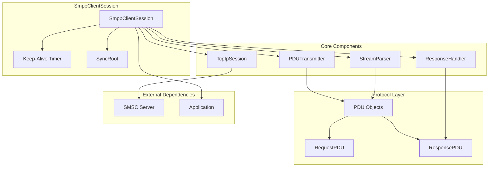

## Class Structure

### Class Hierarchy
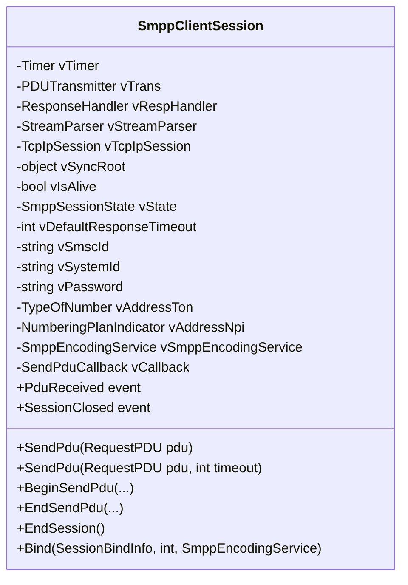

### Core Dependencies
- **StreamParser**: Parses incoming byte streams into PDUs
- **PDUTransmitter**: Sends PDUs to the SMSC
- **ResponseHandler**: Manages response PDU queuing and timeouts
- **TcpIpSession**: Provides TCP/IP communication
- **SmppEncodingService**: Handles character encoding/decoding

## Properties

### Session State Properties
| Property | Type | Description |
|----------|------|-------------|
| `IsAlive` | `bool` | Indicates if the session is active and bound |
| `State` | `SmppSessionState` | Current session state (Open, Transmitter, Receiver, Transceiver, Closed) |
| `SmscID` | `string` | SMSC identifier received during binding |
| `SystemID` | `string` | System identifier used for binding |
| `Password` | `string` | Password used for authentication |

### Configuration Properties
| Property | Type | Description |
|----------|------|-------------|
| `EnquireLinkInterval` | `int` | Interval for keep-alive EnquireLink PDUs (minimum 1000ms) |
| `DefaultResponseTimeout` | `int` | Default timeout for PDU responses |
| `TcpIpProperties` | `TcpIpSessionProperties` | TCP/IP session properties |
| `SyncRoot` | `object` | Synchronization object for thread safety |
| `SmppEncodingService` | `SmppEncodingService` | Encoding service for character handling |

### Address Properties
| Property | Type | Description |
|----------|------|-------------|
| `AddressTon` | `TypeOfNumber` | Type of Number for addresses |
| `AddressNpi` | `NumberingPlanIndicator` | Numbering Plan Indicator for addresses |

### Session States
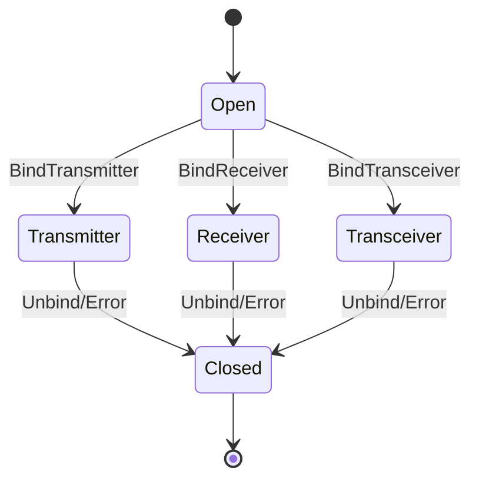

## Events

### Event Types
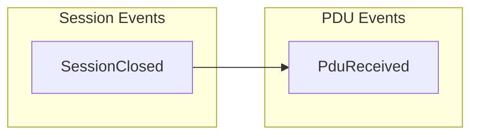

### Event Details

#### PduReceived
```csharp
public event EventHandler<PduReceivedEventArgs> PduReceived;
```
**Purpose**: Raised when a request PDU is received from the SMSC
**Event Args**: `PduReceivedEventArgs`
- `Request`: The received request PDU
- `Response`: Optional response PDU to send back

#### SessionClosed
```csharp
public event EventHandler<SmppSessionClosedEventArgs> SessionClosed;
```
**Purpose**: Raised when the session is closed
**Event Args**: `SmppSessionClosedEventArgs`
- `Reason`: Reason for session closure
- `Exception`: Exception that caused closure (if any)

## Methods

### PDU Operations

#### Send PDU (Synchronous)
```csharp
public ResponsePDU SendPdu(RequestPDU pdu)
public ResponsePDU SendPdu(RequestPDU pdu, int timeout)
```
**Purpose**: Sends a request PDU and waits for response
**Parameters**:
- `pdu`: The request PDU to send
- `timeout`: Timeout for response (optional, uses default if not specified)
**Returns**: `ResponsePDU` from SMSC
**Behavior**:
- Validates session state and PDU compatibility
- Sends PDU via PDUTransmitter
- Waits for response via ResponseHandler
- Handles timeout scenarios

#### Send PDU (Asynchronous)
```csharp
public IAsyncResult BeginSendPdu(RequestPDU pdu, int timeout, AsyncCallback callback, object @object)
public IAsyncResult BeginSendPdu(RequestPDU pdu, AsyncCallback callback, object @object)
public ResponsePDU EndSendPdu(IAsyncResult result)
```
**Purpose**: Sends a request PDU asynchronously
**Parameters**:
- `pdu`: The request PDU to send
- `timeout`: Timeout for response
- `callback`: Callback for completion notification
- `state`: User state object
**Returns**: `IAsyncResult` for async operation tracking

### Session Management

#### End Session
```csharp
public void EndSession()
```
**Purpose**: Gracefully closes the session
**Behavior**:
- Sends Unbind PDU to SMSC
- Waits for UnbindResp
- Cleans up all components
- Raises SessionClosed event

#### Static Bind Method
```csharp
public static SmppClientSession Bind(SessionBindInfo bindInfo, int timeOut, SmppEncodingService smppEncodingService)
```
**Purpose**: Creates and binds a new session
**Parameters**:
- `bindInfo`: Binding information (credentials, server details)
- `timeOut`: Timeout for bind operation
- `smppEncodingService`: Encoding service to use
**Returns**: Bound `SmppClientSession` instance
**Behavior**:
- Creates TCP/IP session
- Assembles components
- Performs SMPP bind operation
- Starts keep-alive timer

## Session Lifecycle

### Binding Process
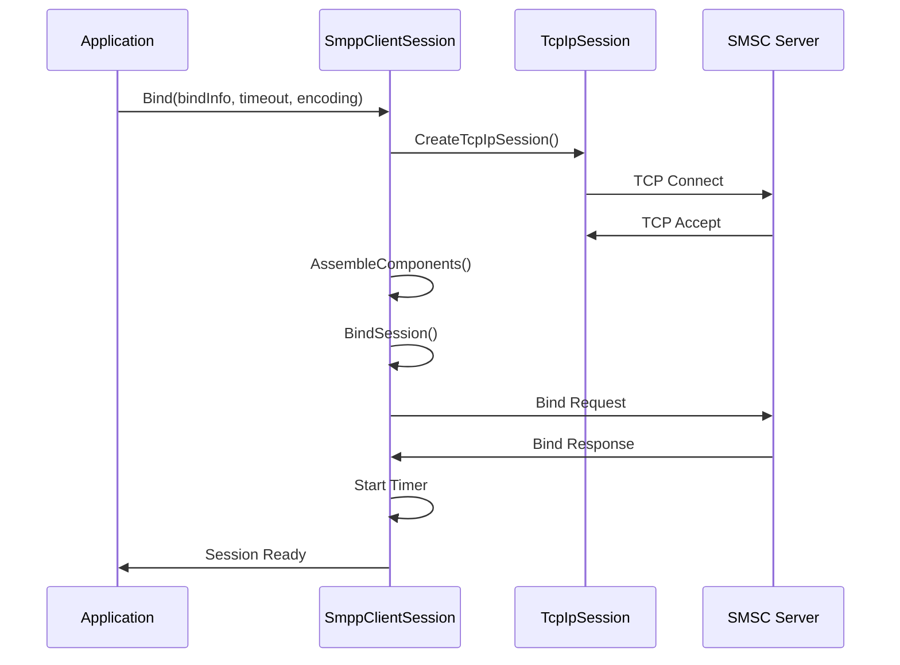

### Component Assembly
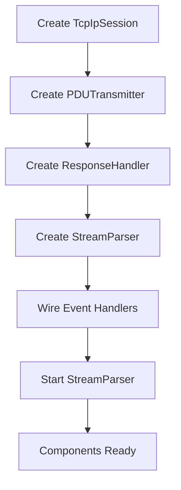

### Session Termination
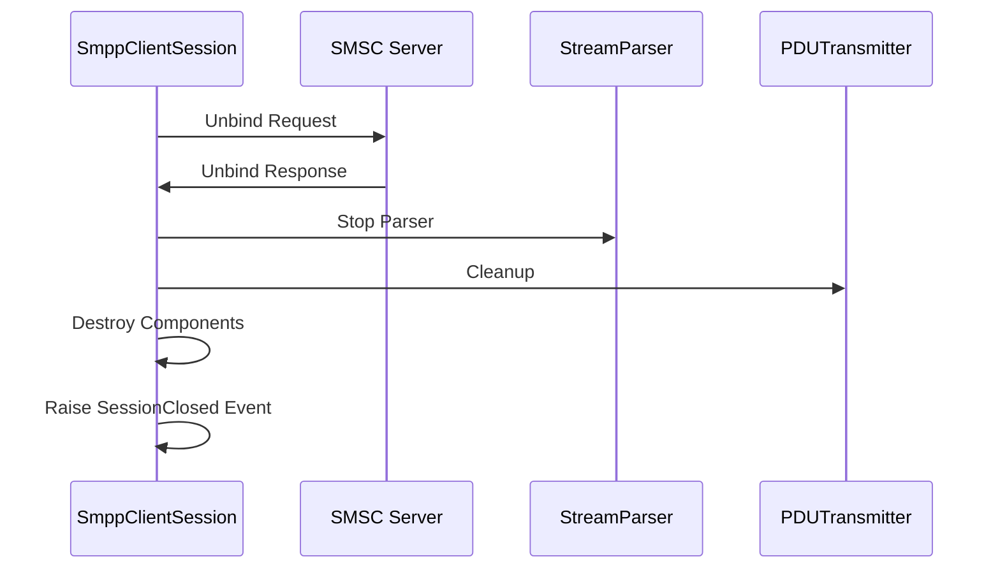

## Component Assembly

### Component Creation Order
1. **TcpIpSession**: Establishes TCP connection
2. **PDUTransmitter**: Handles PDU transmission
3. **ResponseHandler**: Manages response queuing
4. **StreamParser**: Parses incoming data
5. **Event Wiring**: Connects component events
6. **Parser Start**: Begins parsing incoming data

### Component Dependencies
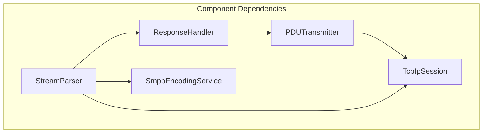

### Event Handler Wiring
```csharp
private void AssembleComponents()
{
    vTrans = new PDUTransmitter(vTcpIpSession);
    vRespHandler = new ResponseHandler();
    vStreamParser = new StreamParser(
        vTcpIpSession, vRespHandler, new PduProcessorCallback(PduRequestProcessorCallback), vSmppEncodingService);
    
    // Wire event handlers
    vStreamParser.ParserException += ParserExceptionEventHandler;
    vStreamParser.PDUError += PduErrorEventHandler;
    
    // Start stream parser
    vStreamParser.Start();
}
```

## PDU Processing

### Incoming PDU Flow
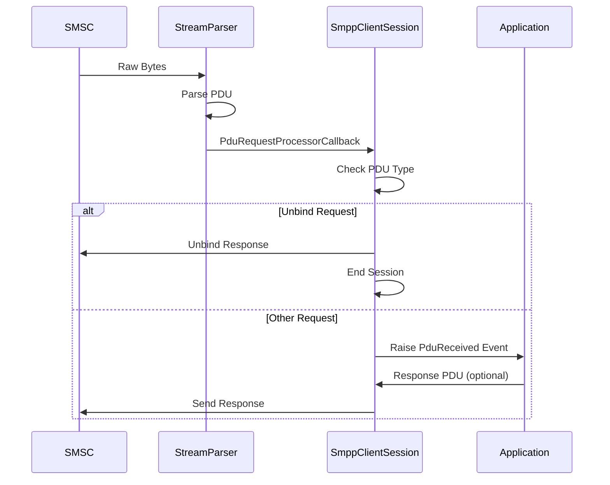

### PDU Type Handling
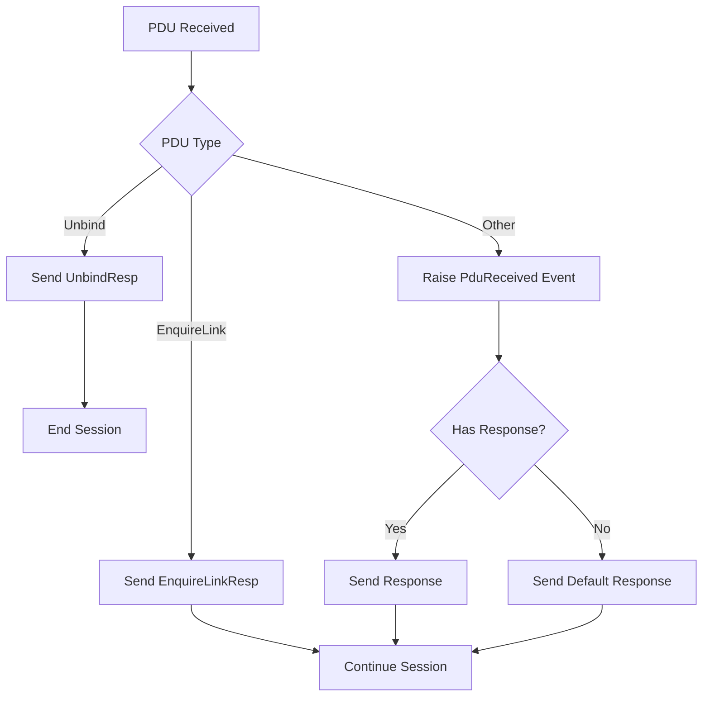

### Response Generation
```csharp
private void PduRequestProcessorCallback(RequestPDU pdu)
{
    ResponsePDU resp = null;
    
    if (pdu is Unbind)
    {
        // Handle unbind request
        resp = pdu.CreateDefaultResponce();
        try { SendPduBase(resp); }
        catch {/*silent catch*/}
        EndSession(SmppSessionCloseReason.UnbindRequested, null);
        return;
    }
    
    // Raise event for other PDUs
    resp = RaisePduReceivedEvent(pdu);
    
    if (resp == null)
    {
        if (pdu.HasResponse)
        {
            resp = pdu.CreateDefaultResponce();
        }
    }
    
    if (resp != null)
    { 
        try { SendPduBase(resp); } 
        catch {/*Silent catch*/} 
    }
}
```

## Keep-Alive Mechanism

### EnquireLink Timer
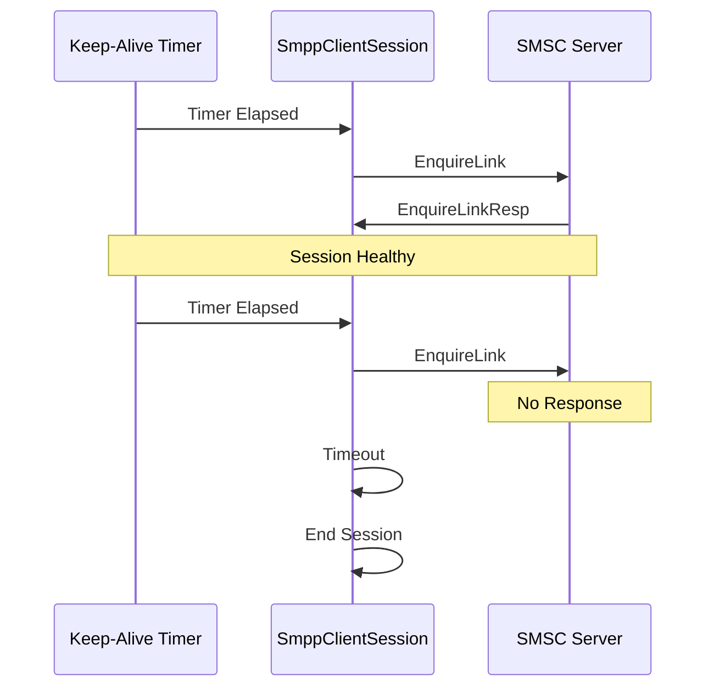

### Timer Configuration
```csharp
private void InitializeTimer()
{
    vTimer = new Timer(DEFAULT_DELAY); // 60 seconds default
    vTimer.Elapsed += new ElapsedEventHandler(TimerCallback);
}

public int EnquireLinkInterval
{
    get { return (int)vTimer.Interval; }
    set
    {
        if (value < 1000) // Minimum 1 second
        {
            throw new ArgumentException("EnqureLink interval cannot be less than 1000 millseconds (1 second)");
        }
        vTimer.Interval = (double)value;
    }
}
```

### Keep-Alive Logic
```csharp
private void TimerCallback(object sender, ElapsedEventArgs e)
{
    EnquireLink enqLink = new EnquireLink(SmppEncodingService);
    
    try
    {
        // Send EnquireLink with 5 seconds response timeout
        EnquireLinkResp resp = (EnquireLinkResp)SendPdu(enqLink, 5000);
    }
    catch (SmppResponseTimedOutException)
    {
        // If there was no response, session is no longer active
        EndSession(SmppSessionCloseReason.EnquireLinkTimeout, null);
    }
    catch (SmppException) { /*Silent catch*/ } // Incorrect bind status
    catch (TcpIpException) {/*Silent catch*/ }
}
```

## Error Handling

### Error Types and Handling
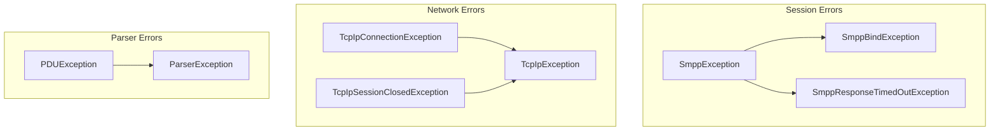

### Error Handling Strategy
1. **Bind Errors**: Throw `SmppBindException` with error details
2. **Timeout Errors**: Handle gracefully with session cleanup
3. **Network Errors**: Close session and raise events
4. **Parser Errors**: Send error responses and continue processing

### Error Recovery
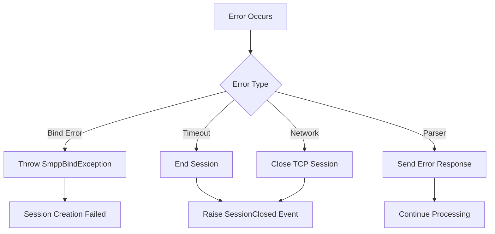

### Exception Event Handling
```csharp
private void ParserExceptionEventHandler(object sender, ParserExceptionEventArgs e)
{
    EndSession(SmppSessionCloseReason.TcpIpSessionError, e.Exception);
}

private void PduErrorEventHandler(object sender, PDUErrorEventArgs e)
{
    ResponsePDU resp = null;
    
    if (e.Pdu is RequestPDU)
    {
        RequestPDU req = (RequestPDU)e.Pdu;
        resp = req.CreateDefaultResponce();
        resp.Header.ErrorCode = e.Exception.ErrorCode;
    }
    else
    {
        resp = new GenericNack(e.Header, vSmppEncodingService);
        resp.Header.ErrorCode = e.Exception.ErrorCode;
    }
    
    try { SendPduBase(resp); }
    catch {/*silent catch*/}
}
```

## Usage Examples

### Creating and Binding a Session
```csharp
// Create binding information
SessionBindInfo bindInfo = new SessionBindInfo();
bindInfo.SystemID = "your_system_id";
bindInfo.Password = "your_password";
bindInfo.ServerName = "smpp.provider.com";
bindInfo.Port = 2775;
bindInfo.InterfaceVersion = InterfaceVersion.v34;
bindInfo.AddressTon = TypeOfNumber.International;
bindInfo.AddressNpi = NumberingPlanIndicator.ISDN;
bindInfo.SystemType = "SMS";

// Create encoding service
SmppEncodingService encodingService = new SmppEncodingService();

// Bind session
SmppClientSession session = SmppClientSession.Bind(bindInfo, 5000, encodingService);

// Configure session
session.EnquireLinkInterval = 30000; // 30 seconds
session.DefaultResponseTimeout = 5000; // 5 seconds

// Subscribe to events
session.PduReceived += (sender, e) => {
    Console.WriteLine($"Received PDU: {e.Request.Header.CommandType}");
    
    // Handle specific PDU types
    if (e.Request is DeliverSm)
    {
        // Process incoming message
        DeliverSm deliverSm = (DeliverSm)e.Request;
        Console.WriteLine($"Message from: {deliverSm.SourceAddress.Address}");
        
        // Send response
        e.Response = deliverSm.CreateDefaultResponce();
    }
};

session.SessionClosed += (sender, e) => {
    Console.WriteLine($"Session closed: {e.Reason}");
};
```

### Sending PDUs
```csharp
// Send a SubmitSm PDU
SubmitSm submitSm = new SubmitSm(encodingService);
submitSm.ServiceType = "SMS";
submitSm.SourceAddress = new SmppAddress("12345");
submitSm.DestinationAddress = new SmppAddress("1234567890");
submitSm.ShortMessage = "Hello, World!";

try
{
    SubmitSmResp response = (SubmitSmResp)session.SendPdu(submitSm, 10000);
    Console.WriteLine($"Message ID: {response.MessageID}");
}
catch (SmppResponseTimedOutException)
{
    Console.WriteLine("Request timed out");
}
catch (SmppException ex)
{
    Console.WriteLine($"SMPP Error: {ex.ErrorCode}");
}
```

### Asynchronous PDU Sending
```csharp
// Send PDU asynchronously
SubmitSm submitSm = new SubmitSm(encodingService);
// ... configure PDU ...

IAsyncResult result = session.BeginSendPdu(submitSm, 10000, (ar) => {
    try
    {
        ResponsePDU response = session.EndSendPdu(ar);
        Console.WriteLine("PDU sent successfully");
    }
    catch (Exception ex)
    {
        Console.WriteLine($"Send failed: {ex.Message}");
    }
}, null);
```

### Session Management
```csharp
// Check session state
if (session.IsAlive)
{
    Console.WriteLine($"Session state: {session.State}");
    Console.WriteLine($"SMSC ID: {session.SmscID}");
    Console.WriteLine($"System ID: {session.SystemID}");
}

// Gracefully close session
session.EndSession();
```

### Error Handling Example
```csharp
session.SessionClosed += (sender, e) => {
    switch (e.Reason)
    {
        case SmppSessionCloseReason.EndSessionCalled:
            Console.WriteLine("Session closed normally");
            break;
        case SmppSessionCloseReason.EnquireLinkTimeout:
            Console.WriteLine("Keep-alive timeout - connection lost");
            break;
        case SmppSessionCloseReason.TcpIpSessionError:
            Console.WriteLine($"Network error: {e.Exception?.Message}");
            break;
        case SmppSessionCloseReason.UnbindRequested:
            Console.WriteLine("SMSC requested unbind");
            break;
    }
};

session.PduReceived += (sender, e) => {
    try
    {
        // Process PDU
        ProcessPdu(e.Request);
    }
    catch (Exception ex)
    {
        Console.WriteLine($"Error processing PDU: {ex.Message}");
        
        // Send error response
        if (e.Request.HasResponse)
        {
            e.Response = e.Request.CreateDefaultResponce();
            e.Response.Header.ErrorCode = SmppErrorCode.ESME_RX_P_APPN;
        }
    }
};
```

### Advanced Configuration
```csharp
// Configure for high-volume scenarios
session.DefaultResponseTimeout = 3000; // 3 seconds
session.EnquireLinkInterval = 60000;   // 1 minute

// Configure encoding service
SmppEncodingService customEncoding = new SmppEncodingService(Encoding.UTF8);
session.SmppEncodingService = customEncoding;

// Thread-safe operations
lock (session.SyncRoot)
{
    if (session.IsAlive)
    {
        // Perform thread-safe operations
    }
}
```

The SmppClientSession provides a robust foundation for SMPP communication, handling the complexities of session management, PDU processing, and error recovery while maintaining thread safety and providing comprehensive event notifications for application integration.
