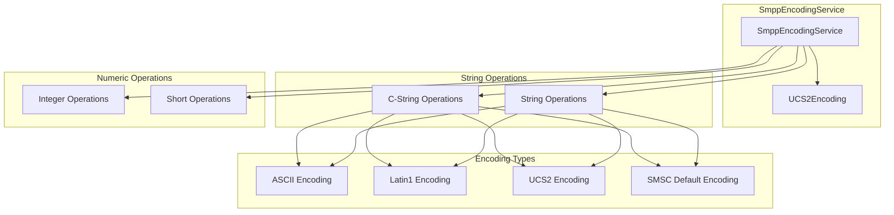
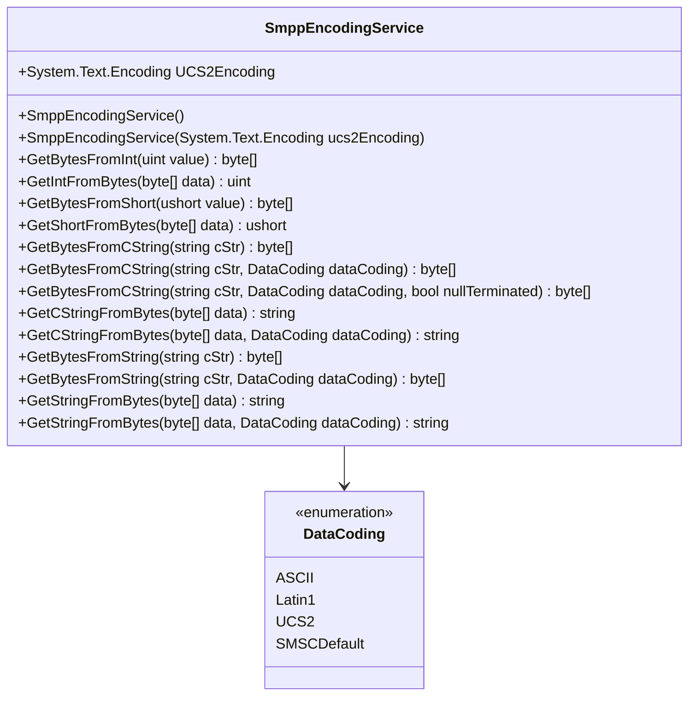
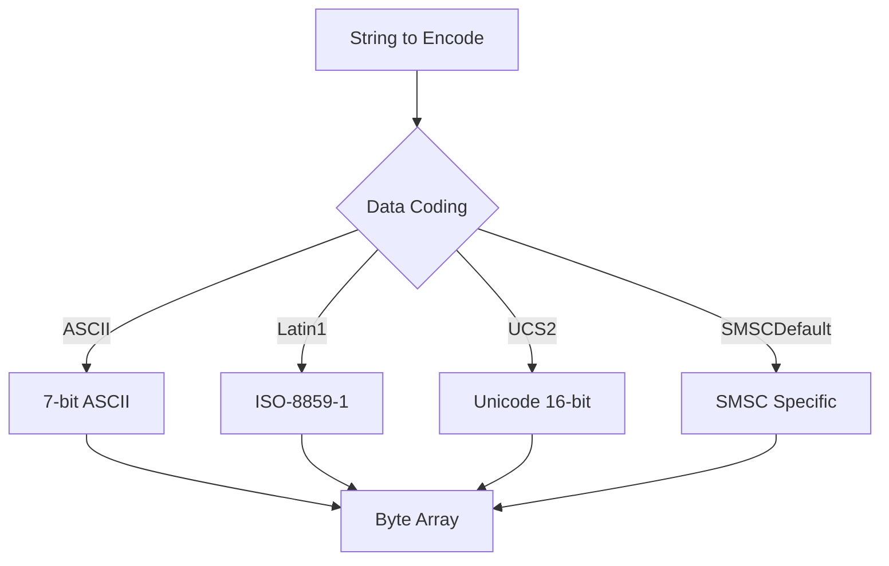
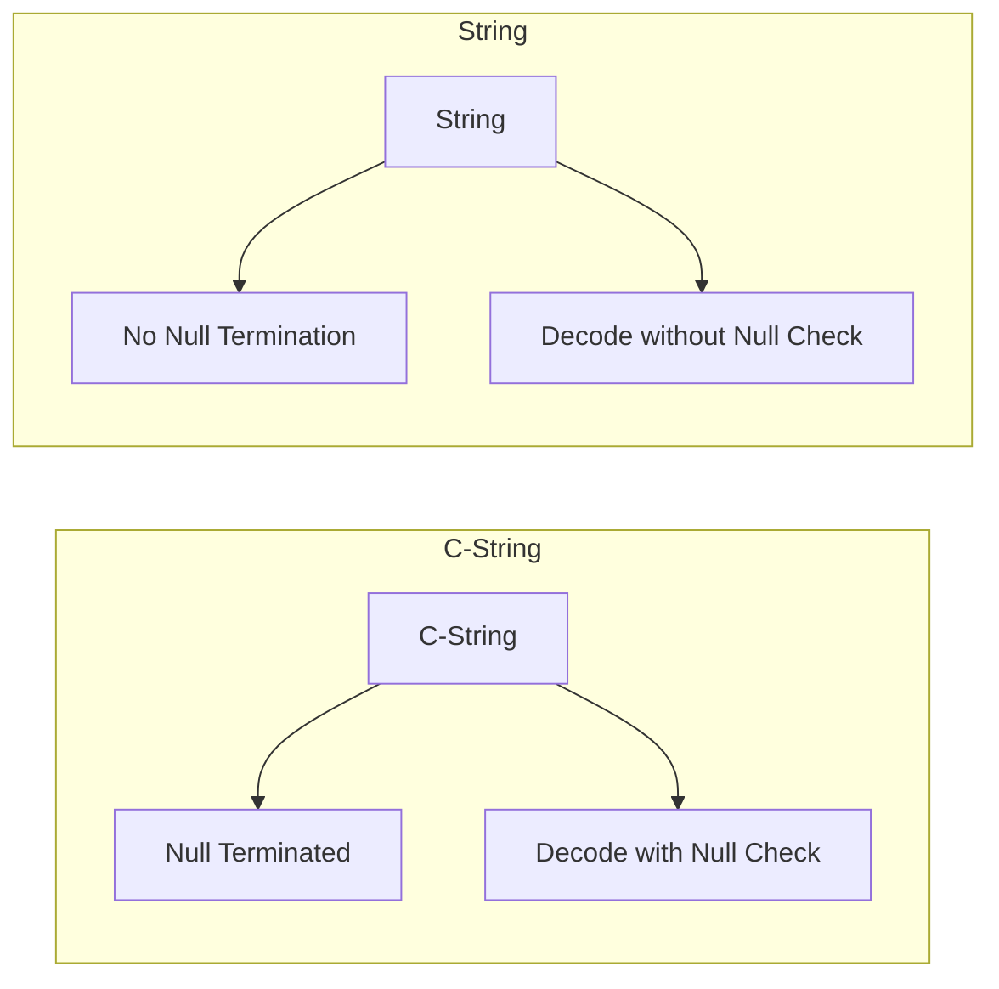
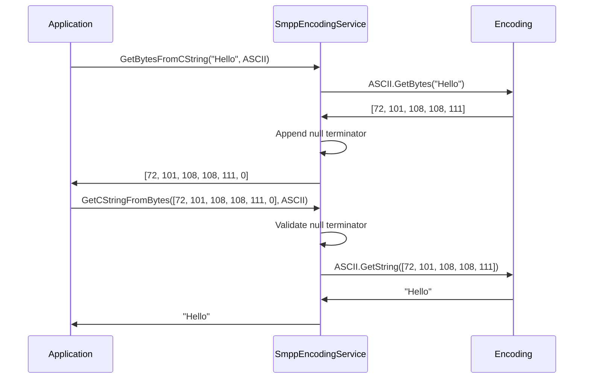
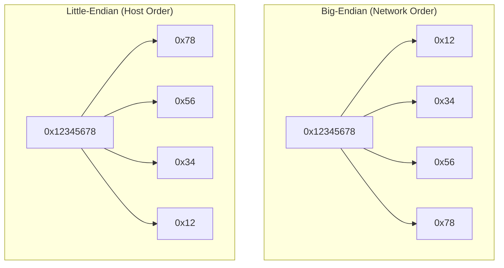

# SmppEncodingService Documentation

## Table of Contents
1. [Overview](#overview)
2. [Architecture](#architecture)
3. [Class Structure](#class-structure)
4. [Data Coding Support](#data-coding-support)
5. [Methods](#methods)
6. [Encoding Types](#encoding-types)
7. [String Handling](#string-handling)
8. [Numeric Conversions](#numeric-conversions)
9. [Usage Examples](#usage-examples)
10. [Performance Considerations](#performance-considerations)

## Overview

The `SmppEncodingService` is a comprehensive service that handles character encoding, decoding, and numeric conversions for SMPP protocol operations. It provides support for multiple character encodings including ASCII, Latin1, UCS2, and SMSC default encoding, while also handling the conversion between different numeric formats used in SMPP PDUs.

### Key Responsibilities
- **Character Encoding**: Converts strings to byte arrays using various encodings
- **Character Decoding**: Converts byte arrays back to strings
- **Numeric Conversions**: Handles integer and short conversions to/from byte arrays
- **C-String Handling**: Manages null-terminated strings
- **Encoding Validation**: Ensures proper encoding selection and error handling

## Architecture

The SmppEncodingService operates as a centralized encoding/decoding service:



## Class Structure

### Class Definition


### Dependencies
- **System.Text.Encoding**: .NET framework encoding classes
- **DataCoding**: SMPP data coding enumeration
- **Latin1Encoding**: Custom Latin1 encoding implementation
- **SMSCDefaultEncoding**: Custom SMSC default encoding implementation

## Data Coding Support

### Supported Data Codings
| Data Coding | Description | Use Case |
|-------------|-------------|----------|
| `ASCII` | 7-bit ASCII encoding | Basic English text |
| `Latin1` | ISO-8859-1 encoding | Western European languages |
| `UCS2` | Unicode 16-bit encoding | International text, emojis |
| `SMSCDefault` | SMSC-specific encoding | Provider-specific encoding |

### Data Coding Selection


## Methods

### Constructors

#### Default Constructor
```csharp
public SmppEncodingService() : this(System.Text.Encoding.BigEndianUnicode)
```
**Purpose**: Creates service with default UCS2 encoding (BigEndianUnicode)
**Behavior**: Uses BigEndianUnicode for UCS2 operations

#### Custom Encoding Constructor
```csharp
public SmppEncodingService(System.Text.Encoding ucs2Encoding)
```
**Purpose**: Creates service with custom UCS2 encoding
**Parameters**:
- `ucs2Encoding`: Custom encoding for UCS2 operations
**Use Case**: When different UCS2 byte order is required

### Numeric Conversion Methods

#### Integer Operations
```csharp
public virtual byte[] GetBytesFromInt(uint value)
public virtual uint GetIntFromBytes(byte[] data)
```
**Purpose**: Converts between 32-bit integers and 4-byte arrays
**Byte Order**: Big-endian (network byte order)
**Validation**: Throws exceptions for invalid array lengths

#### Short Operations
```csharp
public virtual byte[] GetBytesFromShort(ushort value)
public virtual ushort GetShortFromBytes(byte[] data)
```
**Purpose**: Converts between 16-bit shorts and 2-byte arrays
**Byte Order**: Big-endian (network byte order)
**Validation**: Throws exceptions for invalid array lengths

### C-String Methods

#### C-String Encoding
```csharp
public virtual byte[] GetBytesFromCString(string cStr)
public virtual byte[] GetBytesFromCString(string cStr, DataCoding dataCoding)
public virtual byte[] GetBytesFromCString(string cStr, DataCoding dataCoding, bool nullTerminated)
```
**Purpose**: Converts strings to null-terminated byte arrays
**Parameters**:
- `cStr`: String to encode
- `dataCoding`: Encoding type to use
- `nullTerminated`: Whether to append null terminator
**Behavior**: Appends null byte (0x00) unless `nullTerminated` is false

#### C-String Decoding
```csharp
public virtual string GetCStringFromBytes(byte[] data)
public virtual string GetCStringFromBytes(byte[] data, DataCoding dataCoding)
```
**Purpose**: Converts null-terminated byte arrays to strings
**Validation**: Ensures last byte is null terminator
**Behavior**: Removes null terminator from result

### String Methods

#### String Encoding
```csharp
public virtual byte[] GetBytesFromString(string cStr)
public virtual byte[] GetBytesFromString(string cStr, DataCoding dataCoding)
```
**Purpose**: Converts strings to byte arrays without null termination
**Use Case**: For fields that don't require null termination

#### String Decoding
```csharp
public virtual string GetStringFromBytes(byte[] data)
public virtual string GetStringFromBytes(byte[] data, DataCoding dataCoding)
```
**Purpose**: Converts byte arrays to strings
**Behavior**: Removes any null characters from result

## Encoding Types

### ASCII Encoding
```csharp
case DataCoding.ASCII:
    bytes = System.Text.Encoding.ASCII.GetBytes(cStr);
    break;
```
**Characteristics**:
- 7-bit encoding
- English characters only
- 1 byte per character
- Most efficient for English text

### Latin1 Encoding
```csharp
case DataCoding.Latin1:
    bytes = Latin1Encoding.GetBytes(cStr);
    break;
```
**Characteristics**:
- 8-bit encoding
- Western European languages
- 1 byte per character
- Extended ASCII character set

### UCS2 Encoding
```csharp
case DataCoding.UCS2:
    bytes = UCS2Encoding.GetBytes(cStr);
    break;
```
**Characteristics**:
- 16-bit Unicode encoding
- International text support
- 2 bytes per character
- Big-endian byte order

### SMSC Default Encoding
```csharp
case DataCoding.SMSCDefault:
    bytes = SMSCDefaultEncoding.GetBytes(cStr);
    break;
```
**Characteristics**:
- Provider-specific encoding
- Varies by SMSC
- Usually 8-bit encoding
- May support local character sets

## String Handling

### C-String vs String


### String Processing Flow


## Numeric Conversions

### Integer Conversion
```csharp
// Convert uint to bytes (big-endian)
uint value = 0x12345678;
byte[] bytes = encodingService.GetBytesFromInt(value);
// Result: [0x12, 0x34, 0x56, 0x78]

// Convert bytes to uint
uint result = encodingService.GetIntFromBytes(bytes);
// Result: 0x12345678
```

### Short Conversion
```csharp
// Convert ushort to bytes (big-endian)
ushort value = 0x1234;
byte[] bytes = encodingService.GetBytesFromShort(value);
// Result: [0x12, 0x34]

// Convert bytes to ushort
ushort result = encodingService.GetShortFromBytes(bytes);
// Result: 0x1234
```

### Byte Order Handling


## Usage Examples

### Basic String Encoding/Decoding
```csharp
// Create encoding service
SmppEncodingService encodingService = new SmppEncodingService();

// Encode string as C-string
string text = "Hello, World!";
byte[] asciiBytes = encodingService.GetBytesFromCString(text, DataCoding.ASCII);
// Result: [72, 101, 108, 108, 111, 44, 32, 87, 111, 114, 108, 100, 33, 0]

// Decode C-string
string decoded = encodingService.GetCStringFromBytes(asciiBytes, DataCoding.ASCII);
// Result: "Hello, World!"
```

### Unicode Text Handling
```csharp
// Encode Unicode text
string unicodeText = "Hello 世界!";
byte[] ucs2Bytes = encodingService.GetBytesFromCString(unicodeText, DataCoding.UCS2);
// Result: [0x00, 0x48, 0x00, 0x65, 0x00, 0x6C, 0x00, 0x6C, 0x00, 0x6F, 0x00, 0x20, 0x4E, 0x16, 0x75, 0x4C, 0x00, 0x21, 0x00, 0x00]

// Decode Unicode text
string decodedUnicode = encodingService.GetCStringFromBytes(ucs2Bytes, DataCoding.UCS2);
// Result: "Hello 世界!"
```

### Numeric Conversions
```csharp
// Convert sequence number
uint sequenceNumber = 12345;
byte[] seqBytes = encodingService.GetBytesFromInt(sequenceNumber);
// Result: [0x00, 0x00, 0x30, 0x39]

// Convert back
uint decodedSeq = encodingService.GetIntFromBytes(seqBytes);
// Result: 12345

// Convert command length
ushort length = 16;
byte[] lenBytes = encodingService.GetBytesFromShort(length);
// Result: [0x00, 0x10]

// Convert back
ushort decodedLen = encodingService.GetShortFromBytes(lenBytes);
// Result: 16
```

### Custom UCS2 Encoding
```csharp
// Create service with little-endian UCS2
SmppEncodingService customEncoding = new SmppEncodingService(Encoding.Unicode);

// Encode with custom encoding
string text = "Test";
byte[] bytes = customEncoding.GetBytesFromCString(text, DataCoding.UCS2);
// Uses little-endian instead of big-endian
```

### Error Handling
```csharp
try
{
    // Invalid array length for integer
    byte[] invalidBytes = new byte[] { 0x12, 0x34 }; // Only 2 bytes, need 4
    uint result = encodingService.GetIntFromBytes(invalidBytes);
}
catch (ArgumentException ex)
{
    Console.WriteLine($"Invalid array length: {ex.Message}");
}

try
{
    // Invalid C-string (no null terminator)
    byte[] invalidCString = new byte[] { 0x48, 0x65, 0x6C, 0x6C, 0x6F }; // No null terminator
    string result = encodingService.GetCStringFromBytes(invalidCString);
}
catch (ArgumentException ex)
{
    Console.WriteLine($"Invalid C-string: {ex.Message}");
}
```

### Integration with PDU Classes
```csharp
// In PDU class
public class SubmitSm : SmPDU
{
    public void SetServiceType(string serviceType)
    {
        // Use encoding service to convert string to bytes
        byte[] bytes = vSmppEncodingService.GetBytesFromCString(serviceType, DataCoding.ASCII);
        // Store bytes in PDU
    }
    
    public string GetServiceType()
    {
        // Use encoding service to convert bytes to string
        return vSmppEncodingService.GetCStringFromBytes(serviceTypeBytes, DataCoding.ASCII);
    }
}
```

### Performance Optimization
```csharp
// Reuse encoding service instance
SmppEncodingService encodingService = new SmppEncodingService();

// For high-volume scenarios, consider caching
Dictionary<string, byte[]> stringCache = new Dictionary<string, byte[]>();

public byte[] GetCachedBytes(string text, DataCoding coding)
{
    string key = $"{text}_{coding}";
    if (!stringCache.TryGetValue(key, out byte[] bytes))
    {
        bytes = encodingService.GetBytesFromCString(text, coding);
        stringCache[key] = bytes;
    }
    return bytes;
}
```

## Performance Considerations

### Memory Management
- **Byte Array Creation**: Each encoding operation creates new byte arrays
- **String Immutability**: .NET strings are immutable, creating new instances
- **Garbage Collection**: High-frequency encoding may cause GC pressure

### Encoding Performance
| Encoding | Performance | Memory Usage | Use Case |
|----------|-------------|--------------|----------|
| ASCII | Fastest | Lowest | English text only |
| Latin1 | Fast | Low | Western European |
| UCS2 | Slower | Higher | International text |
| SMSCDefault | Variable | Variable | Provider-specific |

### Optimization Strategies
1. **Reuse Instances**: Reuse SmppEncodingService instances
2. **Caching**: Cache frequently used encoded strings
3. **Pooling**: Use object pooling for high-volume scenarios
4. **Lazy Loading**: Initialize encodings only when needed

### Memory Usage Monitoring
```csharp
// Monitor memory usage
long memoryBefore = GC.GetTotalMemory(false);
byte[] bytes = encodingService.GetBytesFromCString(text, DataCoding.UCS2);
long memoryAfter = GC.GetTotalMemory(false);
Console.WriteLine($"Memory allocated: {memoryAfter - memoryBefore} bytes");
```

### Thread Safety
- **Thread-Safe**: SmppEncodingService is thread-safe
- **Stateless**: No instance state that could cause concurrency issues
- **Shared Usage**: Can be safely shared across multiple threads

The SmppEncodingService provides a robust and efficient foundation for all character encoding and numeric conversion operations in the SMPP library, supporting multiple encodings while maintaining compatibility with SMPP protocol requirements.
