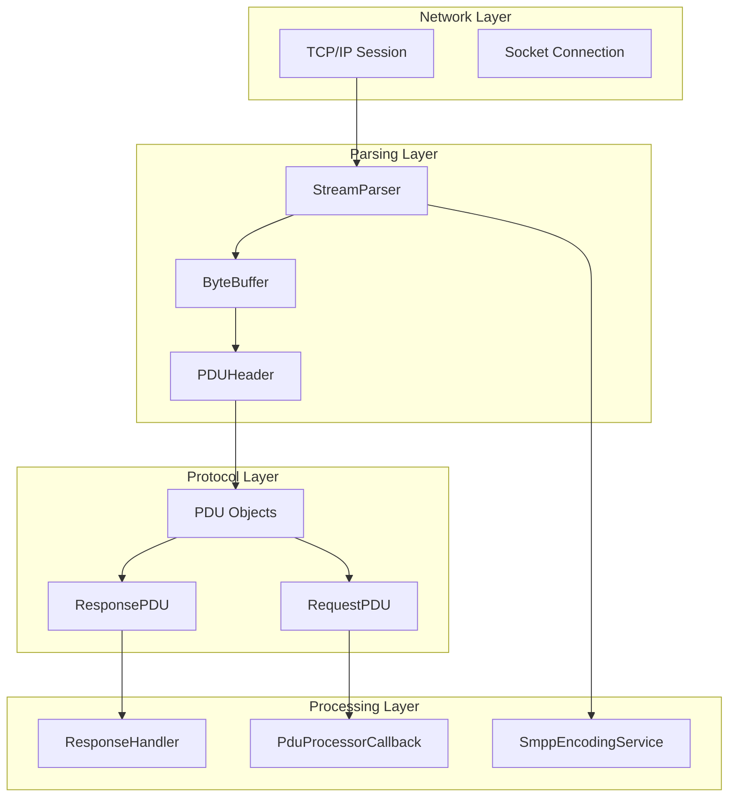
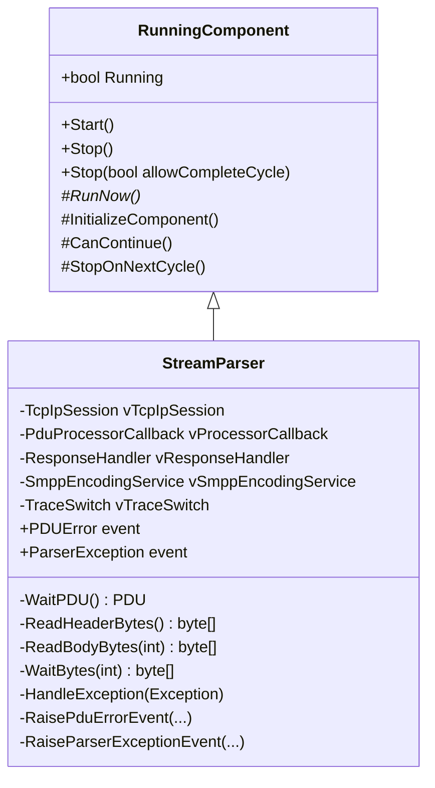
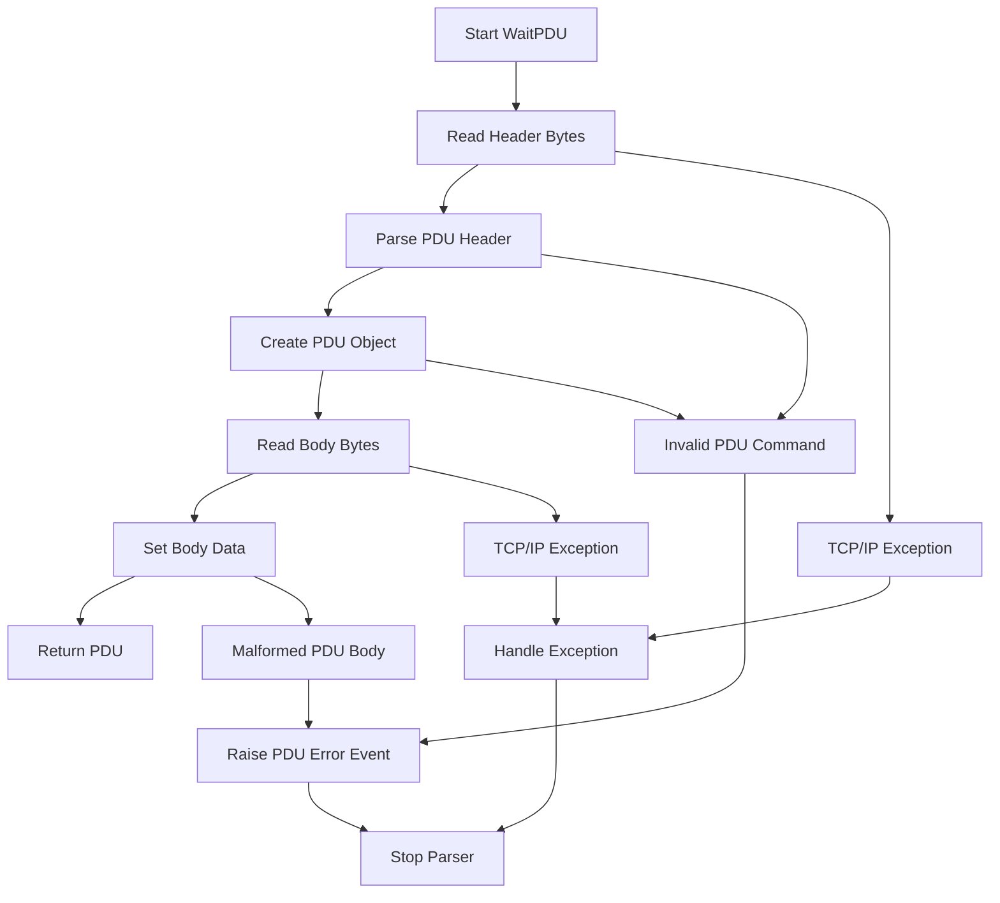
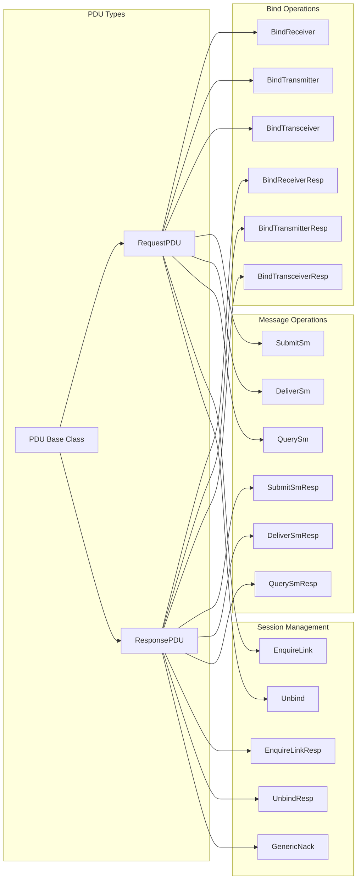
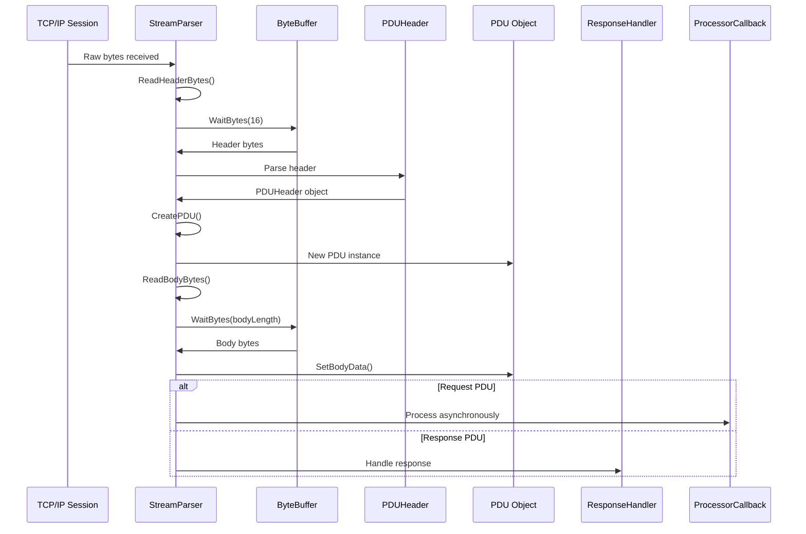
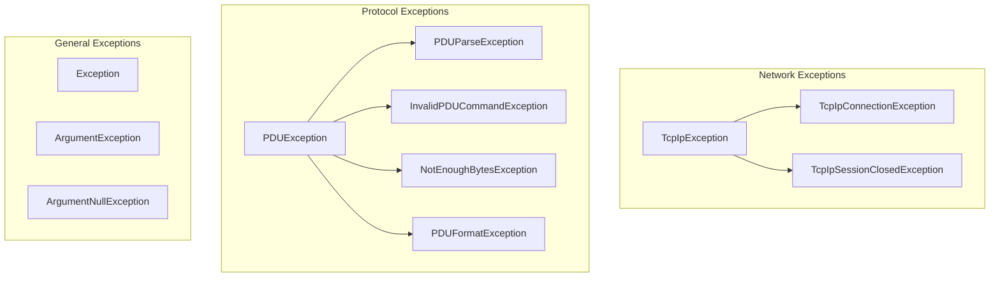

# StreamParser Documentation

## Table of Contents
1. [Overview](#overview)
2. [Architecture](#architecture)
3. [StreamParser Class](#streamparser-class)
4. [Related Components](#related-components)
5. [Data Flow](#data-flow)
6. [Error Handling](#error-handling)
7. [Threading Model](#threading-model)
8. [SMPP Protocol Support](#smpp-protocol-support)
9. [Usage Examples](#usage-examples)
10. [Performance Considerations](#performance-considerations)

## Overview

The `StreamParser` is a critical component of the Jamaa SMPP Library that serves as the bridge between raw TCP/IP byte streams and structured SMPP Protocol Data Units (PDUs). It operates as a continuous background thread that reads incoming data from a TCP/IP session, parses it into PDU headers and bodies, and routes the resulting PDUs to appropriate handlers.

### Key Responsibilities
- **Byte Stream Processing**: Reads raw bytes from TCP/IP connections
- **PDU Parsing**: Converts byte streams into structured SMPP PDUs
- **Protocol Validation**: Ensures incoming data conforms to SMPP specifications
- **Error Handling**: Manages malformed data and network exceptions
- **Asynchronous Processing**: Handles PDU processing in a non-blocking manner

## Architecture

The StreamParser operates within a layered architecture that separates concerns between network communication, protocol parsing, and business logic processing.



## StreamParser Class

### Class Hierarchy


### Core Methods

#### Constructor
```csharp
public StreamParser(TcpIpSession session, ResponseHandler responseQueue, 
                   PduProcessorCallback requestProcessor, SmppEncodingService smppEncodingService)
```

**Parameters:**
- `session`: TCP/IP session for reading data
- `responseQueue`: Handler for response PDUs
- `requestProcessor`: Callback for processing request PDUs
- `smppEncodingService`: Service for encoding/decoding operations

#### Main Processing Loop (`RunNow`)
The core processing loop continuously reads and processes PDUs:

```csharp
protected override void RunNow()
{
    while (CanContinue())
    {
        try
        {
            PDU pdu = WaitPDU();
            if (pdu is RequestPDU)
            {
                // Process asynchronously
                System.Threading.Tasks.Task.Run(() => vProcessorCallback.Invoke((RequestPDU)pdu));
            }
            else if (pdu is ResponsePDU) 
            { 
                vResponseHandler.Handle(pdu as ResponsePDU); 
            }
        }
        catch (PDUException) { /*Silent catch*/ }
        catch (TcpIpException) { /*Silent catch*/ }
        catch (Exception ex)
        {
            // Log and rethrow unexpected exceptions
            _Log.ErrorFormat("200015:Unanticipated stream parser exception: {0}", ex, ex.Message);
            throw;
        }
    }
}
```

#### PDU Parsing Process (`WaitPDU`)
The PDU parsing follows a structured approach:



## Related Components

### ResponseHandler
Manages response PDU queuing and timeout handling:

```csharp
public class ResponseHandler
{
    private IDictionary<uint, ResponsePDU> vResponseQueue;
    private IDictionary<uint, PDUWaitContext> vWaitingQueue;
    private AutoResetEvent vResponseEvent;
    private AutoResetEvent vWaitingEvent;
    
    public void Handle(ResponsePDU pdu)
    public ResponsePDU WaitResponse(RequestPDU pdu)
    public ResponsePDU WaitResponse(RequestPDU pdu, int timeOut)
}
```

**Key Features:**
- Thread-safe response queuing
- Timeout management for response waiting
- Automatic cleanup of expired requests

### TcpIpSession
Provides the underlying network communication:

```csharp
public class TcpIpSession
{
    protected Socket vSocket;
    private SessionType vSessionType;
    private bool vIsAlive;
    
    public void Send(byte[] buffer)
    public int Receive(byte[] buffer, int start, int length)
    public void EndSession()
}
```

**Key Features:**
- Socket management and lifecycle
- Exception handling for network issues
- Connection state monitoring

### PDU Classes
The protocol layer consists of various PDU types:



## Data Flow

### Incoming Data Processing


### PDU Structure
Each SMPP PDU follows a standard structure:

```
+------------------+------------------+------------------+------------------+
| Command Length   | Command Type     | Command Status   | Sequence Number  |
| (4 bytes)        | (4 bytes)        | (4 bytes)        | (4 bytes)        |
+------------------+------------------+------------------+------------------+
|                                                                          |
|                            PDU Body                                      |
|                        (Variable Length)                                 |
|                                                                          |
+------------------+------------------+------------------+------------------+
|                                                                          |
|                      Optional Parameters (TLV)                           |
|                        (Variable Length)                                 |
|                                                                          |
+------------------+------------------+------------------+------------------+
```

## Error Handling

The StreamParser implements comprehensive error handling for various failure scenarios:

### Exception Types


### Error Handling Strategy
1. **Silent Handling**: PDU and TcpIp exceptions are caught silently to allow processing to continue
2. **Event Raising**: Errors are communicated through events (`PDUError`, `ParserException`)
3. **Graceful Degradation**: The parser attempts to continue processing after recoverable errors
4. **Logging**: All errors are logged with appropriate detail levels

### Error Event Handling
```csharp
private void RaisePduErrorEvent(PDUException exception, byte[] byteDump, PDUHeader header, PDU pdu)
{
    if (PDUError == null) { return; }
    PDUErrorEventArgs e = new PDUErrorEventArgs(exception, byteDump, header, pdu);
    foreach (EventHandler<PDUErrorEventArgs> del in PDUError.GetInvocationList())
    {
        System.Threading.Tasks.Task.Run(() => del.Invoke(this, e));
    }
}
```

## Threading Model

The StreamParser operates in a multi-threaded environment with careful synchronization:

### Thread Architecture
```mermaid
graph TB
    subgraph "Main Thread"
        MT[Main Thread]
    end
    
    subgraph "StreamParser Thread"
        SPT[StreamParser Thread]
        SP[StreamParser.RunNow()]
    end
    
    subgraph "Processing Threads"
        PT1[Task 1]
        PT2[Task 2]
        PTN[Task N]
    end
    
    subgraph "Event Threads"
        ET1[Event Thread 1]
        ET2[Event Thread 2]
    end
    
    MT --> SPT
    SPT --> SP
    SP --> PT1
    SP --> PT2
    SP --> PTN
    SP --> ET1
    SP --> ET2
```

### Thread Safety Features
- **Background Thread**: StreamParser runs as a background thread
- **Asynchronous Processing**: Request PDUs are processed asynchronously using `Task.Run`
- **Event Threading**: Events are raised asynchronously to prevent blocking
- **Synchronization**: Critical sections use appropriate locking mechanisms

### .NET Framework Compatibility
The code includes conditional compilation for different .NET versions:

```csharp
#if NET40
    vProcessorCallback.BeginInvoke((RequestPDU)pdu, AsyncCallBackProcessPduRequest, null);
#else
    System.Threading.Tasks.Task.Run(() => vProcessorCallback.Invoke((RequestPDU)pdu));
#endif
```

## SMPP Protocol Support

The StreamParser supports the complete SMPP 3.4 protocol specification:

### Supported Command Types
| Command Type | Hex Value | Description |
|--------------|-----------|-------------|
| GenericNack | 0x80000000 | Generic negative acknowledgment |
| BindReceiver | 0x00000001 | Bind as receiver |
| BindReceiverResp | 0x80000001 | Bind receiver response |
| BindTransmitter | 0x00000002 | Bind as transmitter |
| BindTransmitterResp | 0x80000002 | Bind transmitter response |
| QuerySm | 0x00000003 | Query message status |
| QuerySmResp | 0x80000003 | Query message response |
| SubmitSm | 0x00000004 | Submit short message |
| SubmitSmResp | 0x80000004 | Submit message response |
| DeliverSm | 0x00000005 | Deliver short message |
| DeliverSmResp | 0x80000005 | Deliver message response |
| UnBind | 0x00000006 | Unbind session |
| UnBindResp | 0x80000006 | Unbind response |
| ReplaceSm | 0x00000007 | Replace message |
| ReplaceSmResp | 0x80000007 | Replace message response |
| CancelSm | 0x00000008 | Cancel message |
| CancelSmResp | 0x80000008 | Cancel message response |
| BindTransceiver | 0x00000009 | Bind as transceiver |
| BindTransceiverResp | 0x80000009 | Bind transceiver response |
| OutBind | 0x0000000b | Outbound bind |
| EnquireLink | 0x00000015 | Enquire link |
| EnquireLinkResp | 0x80000015 | Enquire link response |
| DataSm | 0x00000103 | Data short message |
| DataSmResp | 0x80000103 | Data message response |

### Protocol Features
- **TLV Support**: Optional parameters (Tag-Length-Value)
- **Encoding Support**: Multiple character encodings via `SmppEncodingService`
- **Sequence Numbering**: Automatic sequence number management
- **Error Handling**: Comprehensive error code support

## Usage Examples

### Basic StreamParser Setup
```csharp
// Create TCP/IP session
TcpIpSession session = TcpIpSession.OpenClientSession("smpp.provider.com", 2775);

// Create response handler
ResponseHandler responseHandler = new ResponseHandler();

// Create encoding service
SmppEncodingService encodingService = new SmppEncodingService();

// Create processor callback
PduProcessorCallback processorCallback = (RequestPDU pdu) => {
    // Handle incoming request PDUs
    Console.WriteLine($"Received request: {pdu.Header.CommandType}");
};

// Create and start StreamParser
StreamParser parser = new StreamParser(session, responseHandler, processorCallback, encodingService);
parser.PDUError += (sender, e) => {
    Console.WriteLine($"PDU Error: {e.Exception.Message}");
};
parser.ParserException += (sender, e) => {
    Console.WriteLine($"Parser Exception: {e.Exception.Message}");
};

parser.Start();
```

### Handling Different PDU Types
```csharp
PduProcessorCallback processorCallback = (RequestPDU pdu) => {
    switch (pdu.Header.CommandType)
    {
        case CommandType.BindReceiver:
            HandleBindReceiver((BindReceiver)pdu);
            break;
        case CommandType.BindTransmitter:
            HandleBindTransmitter((BindTransmitter)pdu);
            break;
        case CommandType.BindTransceiver:
            HandleBindTransceiver((BindTransceiver)pdu);
            break;
        case CommandType.SubmitSm:
            HandleSubmitSm((SubmitSm)pdu);
            break;
        case CommandType.DeliverSm:
            HandleDeliverSm((DeliverSm)pdu);
            break;
        case CommandType.EnquireLink:
            HandleEnquireLink((EnquireLink)pdu);
            break;
        default:
            Console.WriteLine($"Unhandled PDU type: {pdu.Header.CommandType}");
            break;
    }
};
```

### Error Handling Example
```csharp
parser.PDUError += (sender, e) => {
    Console.WriteLine($"PDU Error Details:");
    Console.WriteLine($"  Exception: {e.Exception.Message}");
    Console.WriteLine($"  Command Type: {e.Header?.CommandType}");
    Console.WriteLine($"  Sequence Number: {e.Header?.SequenceNumber}");
    Console.WriteLine($"  Byte Dump: {BitConverter.ToString(e.ByteDump)}");
    
    // Handle specific error types
    if (e.Exception is InvalidPDUCommandException)
    {
        Console.WriteLine("Invalid PDU command received");
    }
    else if (e.Exception is PDUParseException)
    {
        Console.WriteLine("Failed to parse PDU body");
    }
};

parser.ParserException += (sender, e) => {
    Console.WriteLine($"Parser Exception: {e.Exception.Message}");
    
    // Handle network exceptions
    if (e.Exception is TcpIpSessionClosedException)
    {
        Console.WriteLine("TCP/IP session was closed");
        // Attempt to reconnect or cleanup
    }
};
```

## Performance Considerations

### Memory Management
- **ByteBuffer Efficiency**: Uses efficient byte array management with automatic resizing
- **PDU Object Pooling**: Consider implementing object pooling for high-throughput scenarios
- **Garbage Collection**: Minimizes object creation in the parsing loop

### Network Optimization
- **Buffer Sizes**: TCP socket buffers are optimized (1KB send, 4KB receive)
- **Nagle Algorithm**: Disabled for low-latency communication
- **Timeout Handling**: Configurable timeouts prevent indefinite blocking

### Threading Performance
- **Asynchronous Processing**: Request PDUs are processed asynchronously to prevent blocking
- **Event Threading**: Events are raised asynchronously to maintain responsiveness
- **Background Thread**: Parser runs as background thread to avoid blocking application shutdown

### Monitoring and Diagnostics
```csharp
// Enable tracing for debugging
TraceSwitch traceSwitch = new TraceSwitch("StreamParserSwitch", "Stream parser switch");
traceSwitch.Level = TraceLevel.Verbose;

// Monitor parser performance
Stopwatch stopwatch = Stopwatch.StartNew();
PDU pdu = WaitPDU();
stopwatch.Stop();
Console.WriteLine($"PDU parsing took: {stopwatch.ElapsedMilliseconds}ms");
```

### Best Practices
1. **Resource Management**: Always properly dispose of TCP sessions and stop parsers
2. **Error Handling**: Implement comprehensive error handling for production environments
3. **Logging**: Use appropriate logging levels to balance performance and debugging needs
4. **Monitoring**: Monitor parser performance and memory usage in production
5. **Configuration**: Tune buffer sizes and timeouts based on network conditions

## Conclusion

The StreamParser is a robust and efficient component that forms the foundation of the Jamaa SMPP Library's protocol handling capabilities. Its design emphasizes reliability, performance, and maintainability while providing comprehensive support for the SMPP protocol specification. The component's modular architecture allows for easy extension and customization while maintaining thread safety and proper error handling throughout the parsing process.

The combination of synchronous parsing with asynchronous processing ensures optimal performance while the comprehensive error handling and logging capabilities make it suitable for production environments. The support for multiple .NET framework versions ensures broad compatibility across different deployment scenarios.
